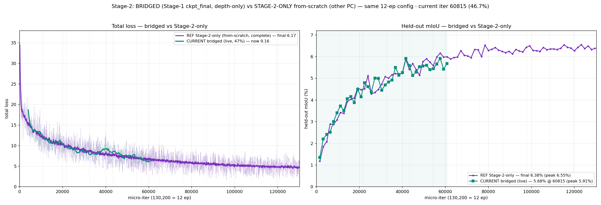
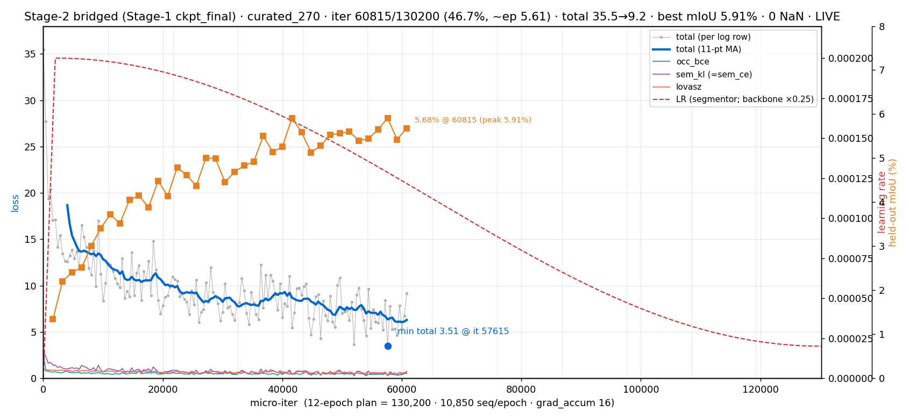
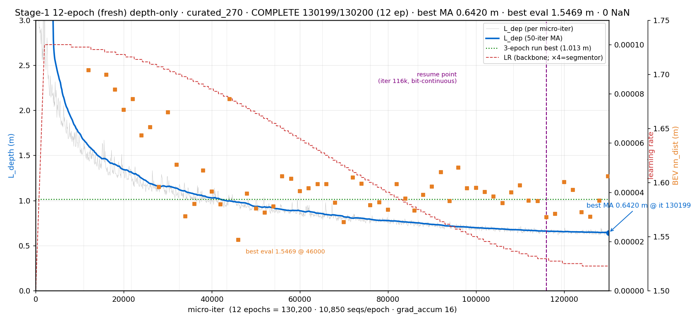
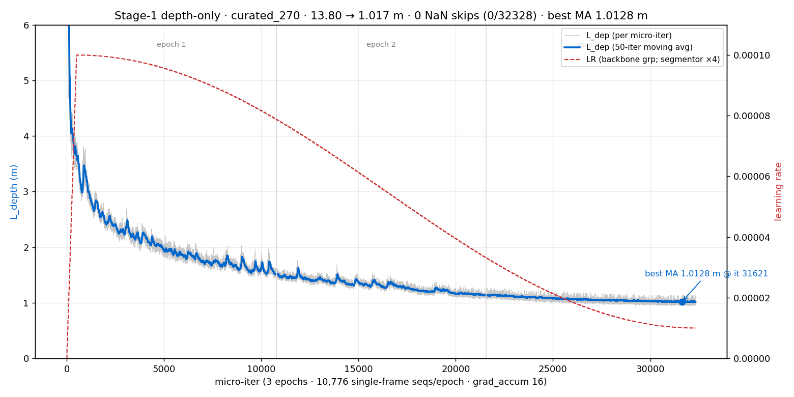
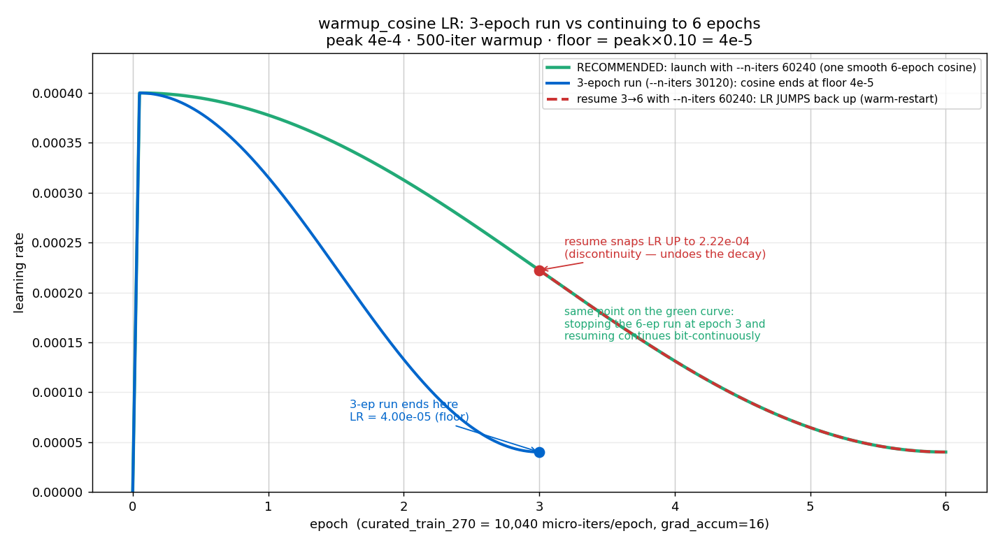
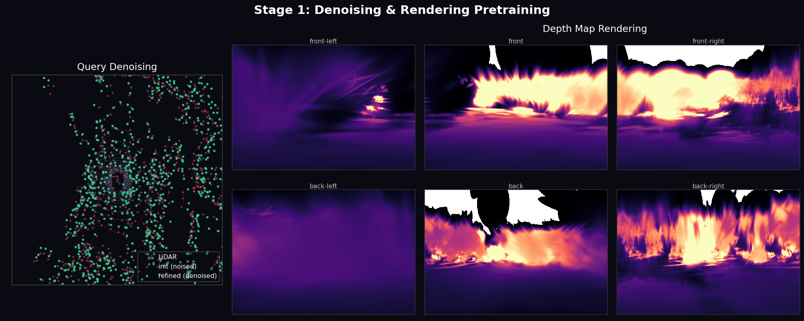
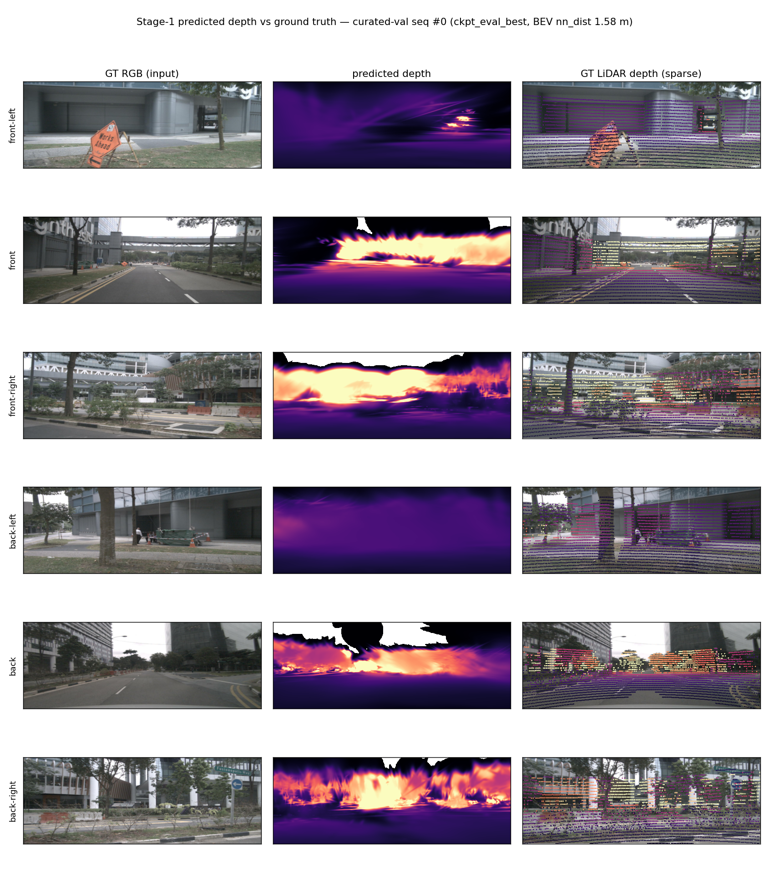
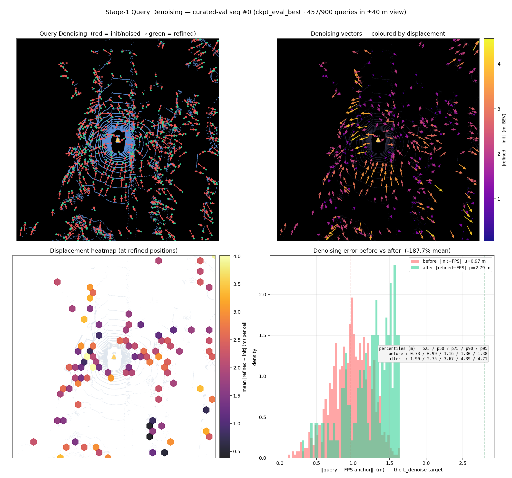
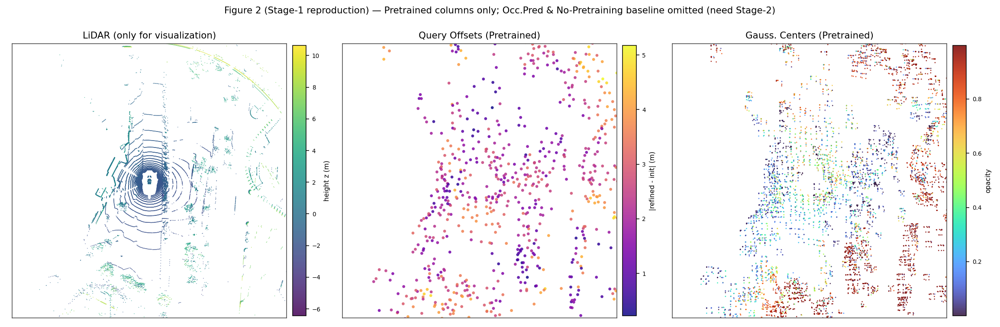

## Results (current best — 12-epoch curated Stage-2)

Stage-2 **from-scratch** (no Stage-1 pretraining) on the **curated
270-train / 50-val** split (`out/stage2_curated_splits.json`; 10 850 train /
2 012 val sequences) for **130 200 micro-iters / 8 138 optimizer steps** =
**12 epochs** at effective batch 16 (`--grad-accum-steps 16`), `warmup_cosine`
2e-4→2e-5, `scale_min=0.05`, bf16 autocast, **0 / 130 200 NaN skips**.
Architecture is paper-spec T2 (`num_layers=6`, `num_pts=13`,
`feedforward_channels=3072`, `K=900`, `J=10`, `embed_dims=768`).
Run dir: `out/stage2_curated_12ep_b16-20260516-135337/`.

### Comparison vs paper (% IoU, 16 classes barrier→vegetation)

| Method | IoU | mIoU | barrier | bicycle | bus | car | const. veh. | motorcycle | pedestrian | traffic cone | trailer | truck | drive. suf. | other flat | sidewalk | terrain | manmade | vegetation |
|---|---|---|---|---|---|---|---|---|---|---|---|---|---|---|---|---|---|---|
| S2GO-Small (paper, Table 1 — *with* Stage-1 pretrain) | 34.3 | 22.1 | 20.8 | 13.1 | 27.5 | 30.3 | 14.5 | 16.5 | 11.7 | 10.9 | 13.5 | 23.3 | 46.3 | 29.4 | 29.7 | 28.4 | 13.0 | 25.1 |
| Paper Table 3 **(a)** — Stage-2-only, no pretrain, ~12 ep | 25.73 | 13.02 | — | — | — | — | — | — | — | — | — | — | — | — | — | — | — | — |
| Paper Table 3 **(a)†** — Stage-2-only, no pretrain, 24 ep | 28.35 | 15.83 | — | — | — | — | — | — | — | — | — | — | — | — | — | — | — | — |
| Paper Table 3 **(f)** — full pretrain (LiDAR+ε init) | 33.91 | 21.60 | — | — | — | — | — | — | — | — | — | — | — | — | — | — | — | — |
| **ours — 12-ep curated, Stage-2-only (this repo)** | **17.98** | **7.73** | 0.99 | 7.41 | 0.07 | 13.61 | 8.72 | 5.12 | 2.75 | 3.33 | 1.13 | 5.84 | 6.95 | 22.81 | 12.47 | 12.34 | 12.72 | 7.38 |

mIoU over the 16 paper-standard classes. The repo's `MeanIoU` also reports a
17-class average including the extra "other" class (12.71 %); that 17-class
value is **8.02 %**. Evaluated on all **2 012** curated-val sequences.
For reference, the prior **3-epoch** curated run (`out/stage2_curated_3ep_b16/`)
scored **6.06 % mIoU (17-cls) / 15.50 % occ-IoU** — so 3→12 ep added
+1.96 pp (17-cls).

### Why our number is below the paper

- **We are a Table 3 *(a)* configuration, not Table 1.** Our runs are
  **Stage-2-only, no pretraining** — the honest yardstick is Table 3
  **(a) 13.02** (~12 ep) / **(a)† 15.83** (24 ep), *not* Table 1's 22.1
  (which *includes* full Stage-1 pretraining). Real Stage-2-only gap ≈
  **5 mIoU**, not ~14.
- **No Stage-1 pretraining.** Per the paper's own ablation, pretraining
  with **LiDAR+ε query init** is worth **+5.8 mIoU at equal compute**
  (a† 15.83 → f 21.60). We have never run it correctly (learnable-init
  pretraining, row (b)=12.42, is *worse* than no pretraining).
- **Curated subset, not full data.** 270 train scenes (~38 % of the
  paper's 700); curation front-loads the most informative scenes, so the
  rest give sub-linear returns.
- **No temporal context.** `T_queue=1` here vs the paper's `T=4` memory
  propagation.
- **Rare thing-classes ≈ 0** (bus 0.07, barrier 0.99, trailer 1.13),
  dragging the 16-class mean down — a data-coverage / compute-scale
  effect, consistent with a Stage-2-only model on a curated subset, not a
  broken pipeline.
- **Epoch-scaling is mostly spent.** 3→12 ep gave +2 pp; the paper's own
  (a)→(a)† shows +2.8 mIoU for 2× epochs. The remaining lever is
  pretraining + data, not more Stage-2 epochs.

## Training & learning curves

### Stage-2: bridged (depth-only Stage-1) vs Stage-2-only from-scratch

Key experiment — bridging Stage-2 from a **depth-only** Stage-1 checkpoint
(λ_denoise=0) vs training Stage-2 from scratch, same 12-epoch config. The
bridged run was stopped at iter 60,815 / 130,200 (47%) because it tracked the
from-scratch baseline with **no measurable benefit** (marginally behind on
loss, even on mIoU). This empirically reproduces the paper's Table-3 finding:
depth-only pretraining is *not* where the gain comes from — the **denoising
objective** is. Full analysis:
`out/stage2_curated_12ep_b16_bridged-20260518-102229/SUMMARY.md`.

### Stage-1 pretraining (depth-only, single-frame) learning curves

12-epoch curated Stage-1 (`--depth-only`, T=1, λ=(0,1,0)) — clean monotone
descent, 0 NaN over 130,200 iters; held-out BEV nn_dist best 1.547 m. The
3-epoch run is the earlier survivor-anchored config.

### LR-schedule design (warmup_cosine, curve = run)

Why the master-curve / run-window decoupling matters: a 3-epoch curve fully
decays at epoch 3 (blue); resuming to 6 epochs is a warm-restart (red); the
correct continuous path is one curve shaped to the full horizon (green).

### Stage-1 qualitative (paper-figure reproductions)

Reproduced from the trained Stage-1 `ckpt_eval_best` (see
`scripts/repro_paper_figs_stage1.py`, `scripts/viz_query_denoising.py`).

