# nuScenes trainval — per-scene SurroundOcc 16-class composition

## Terminology: scenes vs samples vs sample_data

nuScenes uses three distinct levels of granularity; in ML papers the word
"frame" or "keyframe" almost always means **sample**, not scene.

| Concept | nuScenes term | trainval count | rate |
|---|---|---:|---|
| Episode / clip | **scene** | 850 | one per ~20s |
| Keyframe (annotated, multi-sensor synced) | **sample** | 34,149 | 2 Hz |
| Raw sensor frame (intermediate, no annotation) | **sample_data** | millions | 12 Hz camera / 20 Hz lidar |

- A **scene** ≈ episode: one ~20-second driving clip (850 in trainval).
- A **sample** = keyframe: one synchronized time-step within a scene where all
  sensors (6 cameras + 1 lidar + 5 radars) are aligned and have 3D-box
  annotations. Sampled at 2 Hz, so each scene has ~40 samples.
- A **sample_data** record is the raw underlying sensor frame between keyframes
  — used for sweeps / temporal context, not annotated.

The SurroundOcc voxel GT (34,149 `.npy` files) is one **per sample**, not per
scene. Stuff-class totals further down sum voxels across all samples in a
scene; thing-class totals sum 3D-box rows (one per annotation per sample).

## Trainval length per archive part

850 scenes are split into 10 archives of exactly 85 scenes each. Each scene is
~20s of capture, so each archive is ~28 minutes of driving footage.

| Part | Scenes | Keyframes (samples) | Duration | Avg/scene |
|-----:|------:|---------:|---------:|----------:|
|   1 | 85 | 3,376 | 27m 19s | 19.29s |
|   2 | 85 | 3,367 | 27m 16s | 19.25s |
|   3 | 85 | 3,377 | 27m 23s | 19.34s |
|   4 | 85 | 3,409 | 27m 40s | 19.54s |
|   5 | 85 | 3,445 | 27m 54s | 19.70s |
|   6 | 85 | 3,444 | 27m 54s | 19.70s |
|   7 | 85 | 3,441 | 27m 52s | 19.68s |
|   8 | 85 | 3,432 | 27m 51s | 19.66s |
|   9 | 85 | 3,438 | 27m 52s | 19.67s |
|  10 | 85 | 3,420 | 27m 46s | 19.60s |
| **all** | **850** | **34,149** | **4h 36m 52s** | **19.54s** |

The first→last keyframe span comes in just under 20s because keyframes are
sampled at 0.5s intervals and the last keyframe drops a half-step.

---

## Per-scene SurroundOcc 16-class composition

Per-scene class composition for all 850 trainval scenes, combining both data sources:

- **Thing classes 1..10**: 3D-box instance counts from
  `v1.0-trainval/sample_annotation.json` (1,166,187 annotations total), mapped
  via the nuScenes → SurroundOcc category table.
- **Stuff classes 11..16**: voxel counts from the 34,149 SurroundOcc voxel `.npy`
  files in [data/nuscenes_occ/nuscenes_occ/samples/](../data/nuscenes_occ/nuscenes_occ/samples/),
  aggregated per scene.

Generated by [scripts/build_class_composition_stats.py](../scripts/build_class_composition_stats.py).

---

## Thing classes (3D-box instance counts, 1.17M annotations total)

| Class | Total boxes | Scenes containing it |
|-------|------------:|---------------------:|
| car | 494,009 | 847 / 850 |
| pedestrian | 222,164 | 780 |
| barrier | 152,087 | 370 |
| traffic_cone | 97,959 | 565 |
| truck | 88,519 | 699 |
| trailer | 24,860 | **268** ← rarest thing |
| bus | 16,321 | 383 |
| const_veh | 14,671 | **297** |
| motorcycle | 12,617 | 350 |
| bicycle | 11,859 | **348** |

## Stuff classes (voxel counts summed across all keyframes per scene)

| Class | Total voxels | Scenes containing it |
|-------|-------------:|---------------------:|
| vegetation | 346.6M | 837 |
| manmade | 330.2M | 850 |
| drive_surf | 313.8M | 850 |
| terrain | 139.4M | 785 |
| sidewalk | 101.8M | 846 |
| other_flat | 9.8M | **536** ← rarest stuff |

---

## Class-rarity ranking (by number of scenes the class appears in)

Lower = harder to cover when curating a subset:

- **trailer** (268) — driver of the long-tail
- **const_veh** (297)
- **bicycle** (348)
- **motorcycle** (350)
- **barrier** (370)
- **bus** (383)
- **other_flat** (536, stuff)
- **traffic_cone** (565)
- truck (699)
- pedestrian (780), terrain (785)
- vegetation (837), sidewalk (846), car (847), drive_surf / manmade (850)

---

## High-yield scenes for the 5 rarest thing classes

Single best targets when you need the rare class (top scenes by box count):

| Class | Top scene | Boxes | Description (truncated) |
|---|---|---:|---|
| **bicycle** | scene-0377 | 158 | Lane change, cyclist on side walk, construction, left turn |
| **bicycle** | scene-0688 | 155 | Arrive at intersection, many peds, cyclist, bicycle |
| **bicycle** | scene-0687 | 154 | Bicyclists, many peds in sidewalk, turn right, bridge |
| **motorcycle** | scene-0382 | 283 | Turn left, parking lot, peds, parked motorcycles |
| **motorcycle** | scene-0045 | 269 | Full parking lot, peds, exiting from car park |
| **motorcycle** | scene-0916 | 232 | Parking lot, bicycle rack, parked bicycles, parked scooters |
| **const_veh** | scene-0211 | 300 | Parked cars, construction area, construction vehicles |
| **const_veh** | scene-0747 | 287 | Wait at intersection, peds crossing crosswalk, parking lot |
| **const_veh** | scene-0750 | 281 | Wait at intersection, parking lot, traffic chaos, truck blocking |
| **bus** | scene-0647 | 228 | Rain, parked cars, parked buses |
| **bus** | scene-0763 | 214 | Fence, parking lot, bicyclist, buses, parked cars |
| **bus** | scene-0600 | 212 | Rain, parked busses, parking lot |
| **trailer** | scene-0599 | 621 | Rain, peds, construction, turn right, containers, cyclist |
| **trailer** | scene-0448 | 617 | Rain, parked trailers, parked trucks, fence, excavator, barriers |
| **trailer** | scene-0660 | 602 | Painted truck, parked cars |

---

## Output files

- [data/class_composition_per_scene.csv](data/class_composition_per_scene.csv)
  — 850 rows × 16 class columns + metadata (scene_token, name, location,
  vehicle, num_samples, n_lidar_samples_seen, description). Feed this into a
  class-aware curator.
- [data/class_composition_summary.txt](data/class_composition_summary.txt)
  — plain-text version of the global totals.
- [scripts/build_class_composition_stats.py](../scripts/build_class_composition_stats.py)
  — re-runnable; uses multiprocessing for the 34k voxel files.

For context on the upstream per-part diversity stats (location, vehicle, day/night,
rain, description vocabulary, the 255-scene description-tag curation), see
[nuscenes_diversity_stats.md](nuscenes_diversity_stats.md).

---

## Notes & caveats

- **Thing counts are box instances** (one row per annotation, including the same
  object across multiple frames). For per-scene unique instance counts, group by
  `instance_token` instead — the script counts annotations because that's the
  right signal for "how often does the model see this class in this scene".
- **Stuff counts are voxels summed across all lidar keyframes** in the scene,
  not unique voxels. A scene with more samples and more nearby surface will
  dominate; normalise by `n_lidar_samples_seen` (column in the CSV) for fair
  per-frame comparison.
- **Unmapped nuScenes categories** (no SurroundOcc class) are silently dropped:
  `animal`, `movable_object.pushable_pullable`, `movable_object.debris`,
  `static_object.bicycle_rack`. Correct behaviour given the SurroundOcc taxonomy.

---

## Per-archive figures (1–7)

Generated by [../scripts/plot_dataset_stats.py](../scripts/plot_dataset_stats.py).

1. **Per-part size & length** — scenes / keyframes / minutes
   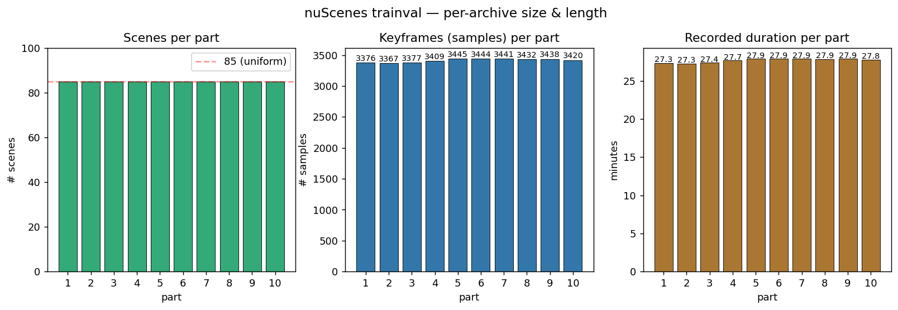

2. **Location distribution per part** — stacked bar of 4 locations across the 10 archives
   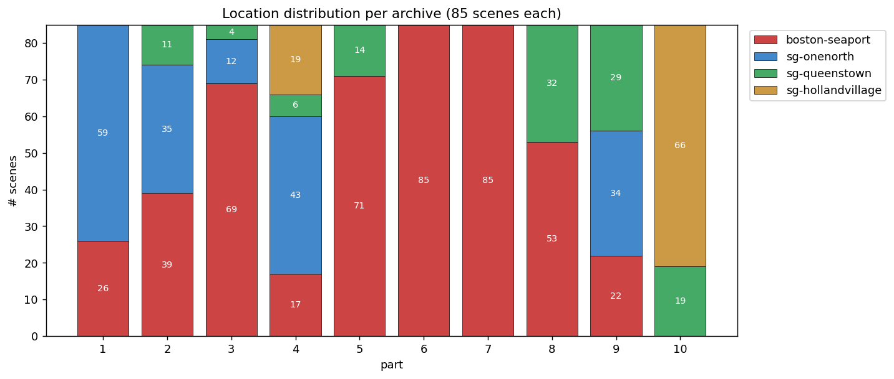

3. **Vehicle + conditions per part** — n008/n015 stacked; night / rain / construction / busy grouped (these tags are independent boolean axes, *not* a partition of the 85 scenes)
   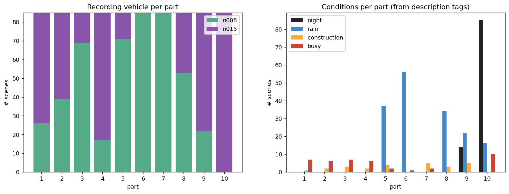

4. **Thing-class instance counts per part (log heatmap)** — 10 things × 10 parts
   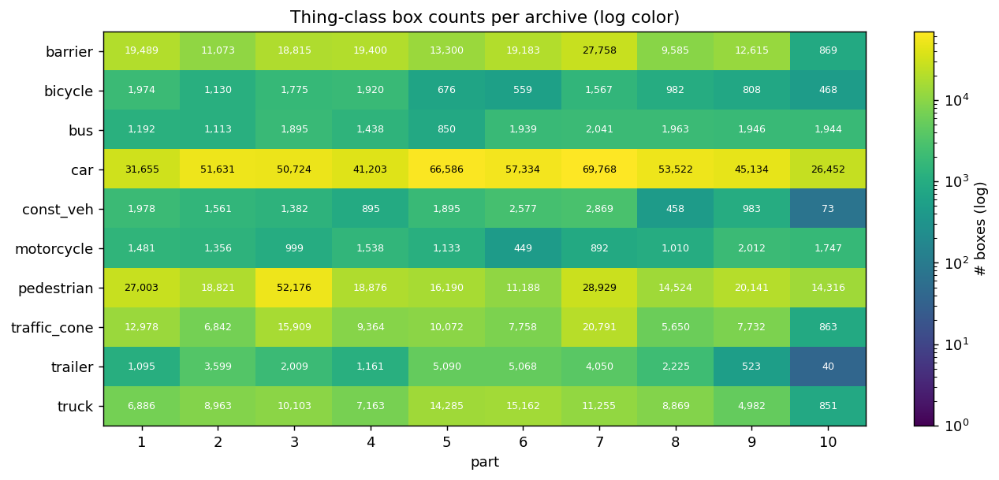

5. **Stuff-class voxel counts per part (log heatmap)** — 6 stuff classes × 10 parts
   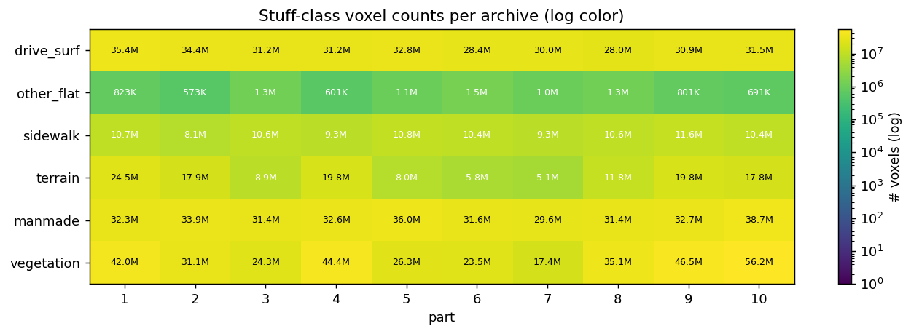

6. **Global class scarcity** — number of scenes containing each class, sorted (red = rare)
   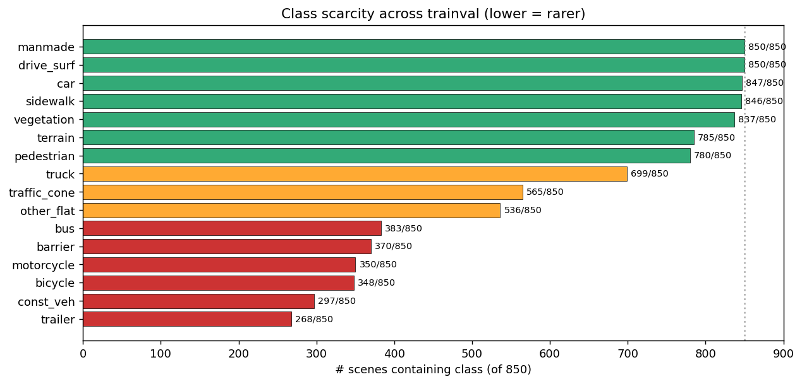

7. **Scene duration & samples-per-scene distributions** — confirms ~20s / ~40 samples per scene
   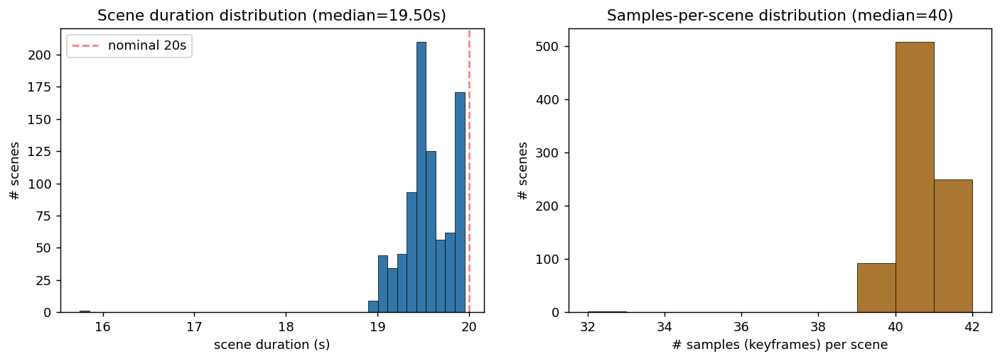

---

## Curated 255-scene subset (v2: anchor + greedy submodular)

Generated by [../scripts/curate_anchor_greedy.py](../scripts/curate_anchor_greedy.py).

**Phase 1 — Anchors (33 scenes):** for each of the 7 rarest thing classes,
hard-include the top-K scenes by box count. Locks in rare-class coverage.

| Class | K | Rationale |
|---|---:|---|
| trailer | 6 | rarest (268/850 scenes) |
| const_veh | 6 | 297/850 |
| bicycle | 5 | 348/850 |
| motorcycle | 5 | 350/850 |
| barrier | 4 | 370/850 |
| bus | 4 | 383/850 |
| traffic_cone | 3 | 565/850 |

**Phase 2 — Greedy fill (222 scenes):** at each step, pick the scene with the
largest concave (sqrt) marginal gain over a feature vector combining
log-class-counts and categorical indicators (location, vehicle, night, rain,
construction, intersection, crosswalk, jaywalker, bus, busy).

#### Marginal-gain formula

For candidate scene `s` given currently-selected set `S` with running sums:

```
F_S[c]  = sum of log(1 + class_count[c]) over scenes in S    # 16 class dims
N_S[k]  = number of scenes in S that satisfy categorical k   # 12 categorical dims

gain(s) = sum over 16 class dims:    sqrt(F_S[c] + f_s[c])  -  sqrt(F_S[c])
        + 2.0 *
          sum over 12 categorical k:  sqrt(N_S[k] + ind_s[k]) - sqrt(N_S[k])

where:
  f_s[c]   = log(1 + count_of_class_c_in_scene_s)
  ind_s[k] = 1 if scene s has tag k, else 0
```

In Python (the actual code, see
[../scripts/curate_anchor_greedy.py](../scripts/curate_anchor_greedy.py)):

```python
def gain(F_class, F_cat, f_cls, f_cat, w_cls, w_cat):
    new_cls = F_class + f_cls
    new_cat = F_cat   + f_cat
    d_cls = (np.sqrt(new_cls) - np.sqrt(F_class)) * w_cls   # w_cls = 1.0 vector
    d_cat = (np.sqrt(new_cat) - np.sqrt(F_cat))   * w_cat   # w_cat = 2.0 vector
    return d_cls.sum() + d_cat.sum()
```

**Why sqrt?** Concave → diminishing returns. The first night scene drives
`sqrt(0+1) - sqrt(0) = 1.0` of gain; the 50th drives `sqrt(50) - sqrt(49) ≈ 0.07`.
The algorithm naturally pivots from saturated axes to under-covered ones without
manual reweighting.

**Why categorical weight 2.0?** Class signals come from a long heavy-tailed
continuous distribution; categorical axes are 0/1. Without upweighting, the
algorithm over-spends its budget chasing the next car-rich scene and
under-covers the 4 locations + 8 tags. Empirically: at `w_cat=1.0`
Singapore-onenorth stayed at 12%; at `w_cat=2.0` it reaches ~25%.

#### Worked example

Suppose `S` already contains 3 scenes covering Boston + day + clear, totalling
150 trailer boxes and 8 night scenes.

- Adding a scene with **0 trailers, night=True**:
  - trailer class term: `sqrt(log(151) + 0) - sqrt(log(151)) = 0`
  - night cat term: `(sqrt(9) - sqrt(8)) * 2.0 = 0.17 * 2.0 = 0.34`
  - total trailer+night contribution: **0.34**
- Adding a scene like scene-0211 (300 trailers, night=False):
  - trailer class term: `sqrt(log(151) + log(301)) - sqrt(log(151)) ≈ 1.21`
  - night cat term: 0
  - total trailer+night contribution: **1.21**

(Real gain sums across all 16 + 12 dims; this is just to show the per-axis
arithmetic.)

### Headline retention by class

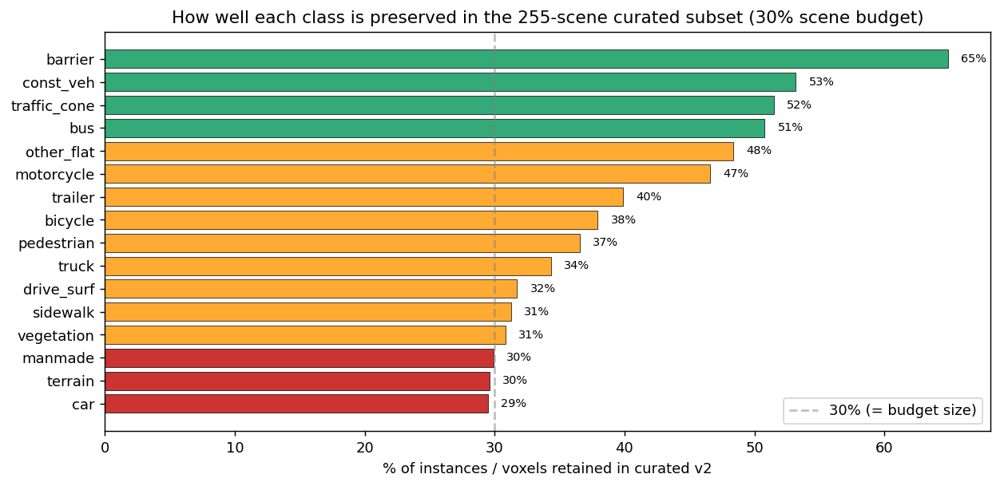

Rare classes are preserved at **40–65%** of their full-set instance counts while
the scene budget is held at **30%**. "Cheap" classes (car, pedestrian,
drive_surf, manmade) sit at exactly 30% — proportional, as expected.

| Class | Full | Curated | % retained |
|---|---:|---:|---:|
| barrier boxes | 152,087 | 98,690 | **65%** |
| const_veh boxes | 14,671 | 7,804 | **53%** |
| traffic_cone boxes | 97,959 | 50,452 | **51%** |
| bus boxes | 16,321 | 8,290 | **51%** |
| other_flat voxels | 9.8M | 4.7M | **48%** |
| motorcycle boxes | 12,617 | 5,877 | **47%** |
| trailer boxes | 24,860 | 9,915 | **40%** |
| bicycle boxes | 11,859 | 4,499 | **38%** |
| pedestrian boxes | 222,164 | 81,185 | 37% |
| truck boxes | 88,519 | 30,407 | 34% |
| car boxes | 494,009 | 145,608 | 30% |
| (other stuff voxels) | — | — | ~30% |

### Where the curated scenes came from

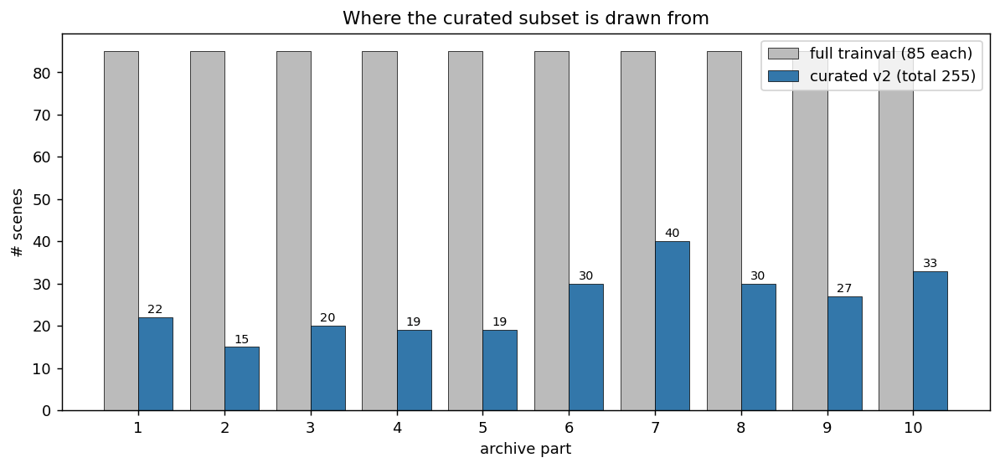

Heavy on parts 8/9/10 (night, rain, Holland Village, mixed locations). Light on
parts 1–3 (homogeneous day-only Boston + Singapore-onenorth). Every archive
contributes — none is dropped entirely.

### Location & vehicle balance

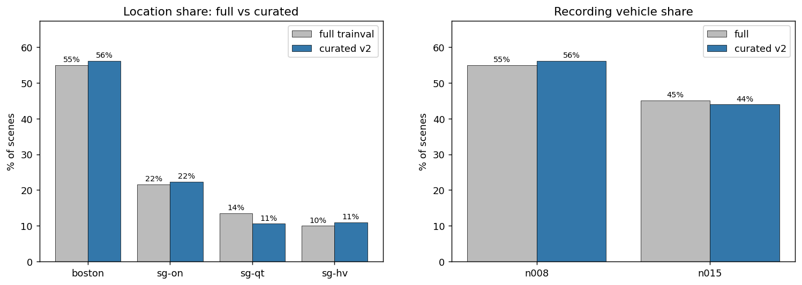

Boston falls from **55% → 36%** of the subset; Singapore boroughs rise. This
reflects where the rare classes and night/rain conditions actually live.

### Condition coverage

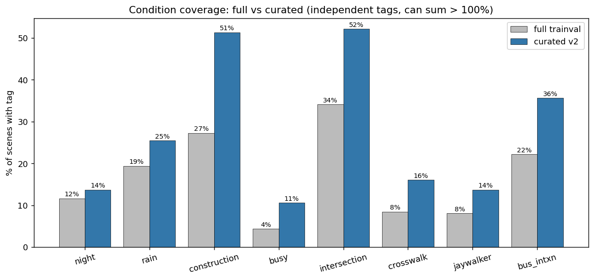

Night, rain, construction, bus-interaction and jaywalker prevalence all **at
least double** in the curated subset relative to full trainval — driven by the
concave coverage objective.

### Raw class totals (log scale)

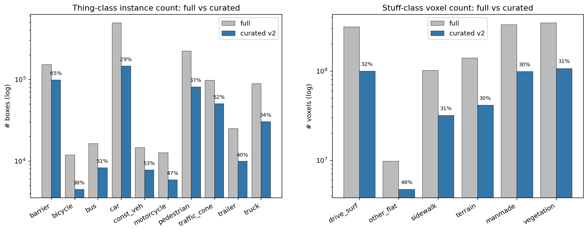

Visual sanity-check on absolute counts: ~50K traffic cones, ~10K trailer boxes,
~6K motorcycle boxes preserved with only 30% of the scenes.

### Output files

- [data/curated_v2_tokens.json](data/curated_v2_tokens.json) — 255 scene tokens
  in pick order (anchors first, then greedy)
- [data/curated_v2_scenes.csv](data/curated_v2_scenes.csv) — readable list with
  scene_name, part, location, vehicle, anchor_for, description

### Summary

| Quantity | Full | Curated v2 |
|---|---:|---:|
| Scenes | 850 | 255 (30%) |
| Keyframes (samples) | 34,149 | 10,255 (30%) |
| Duration | 4h 36m | ~1h 23m |
| Anchored scenes | — | 33 |
