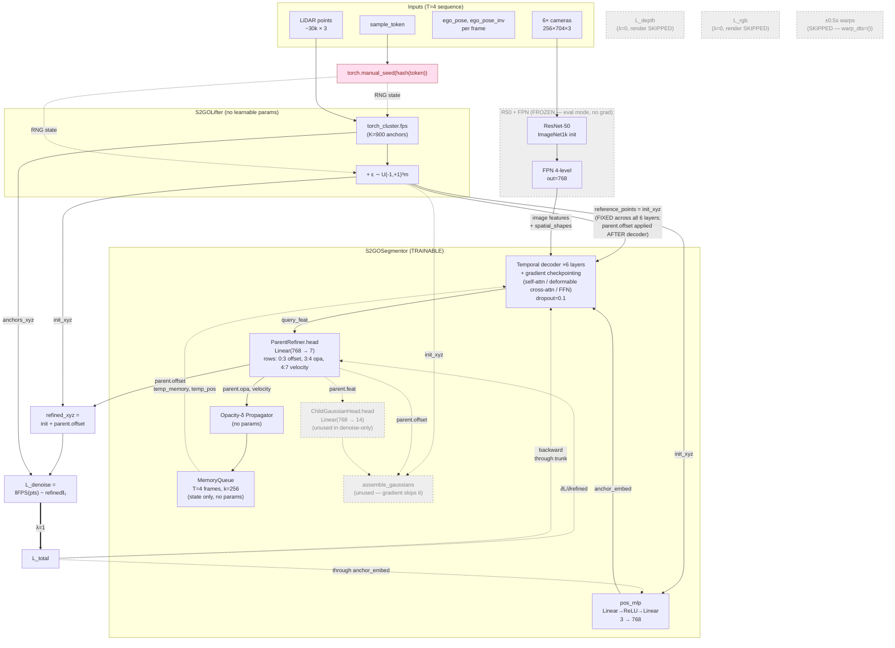
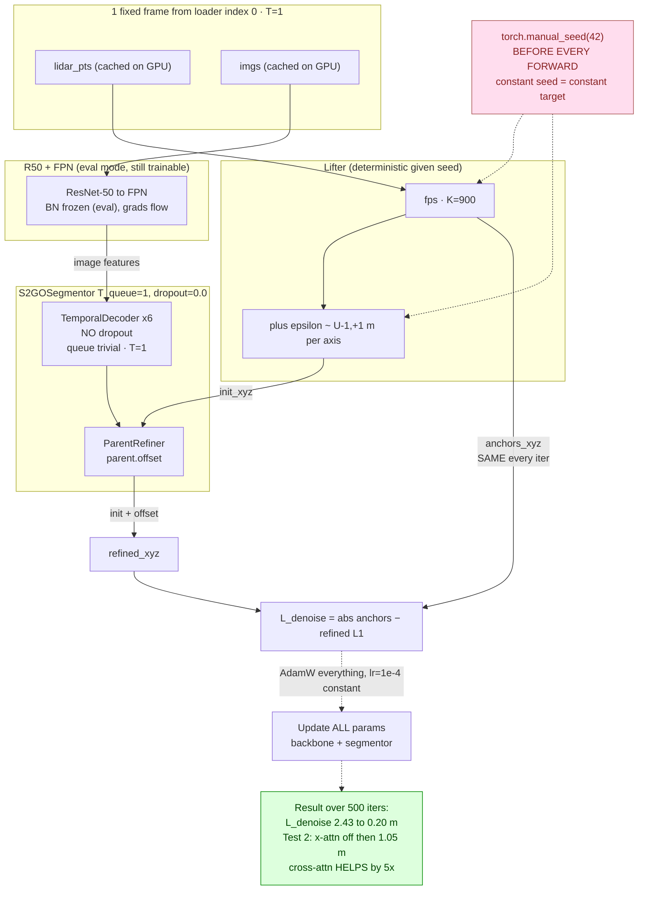
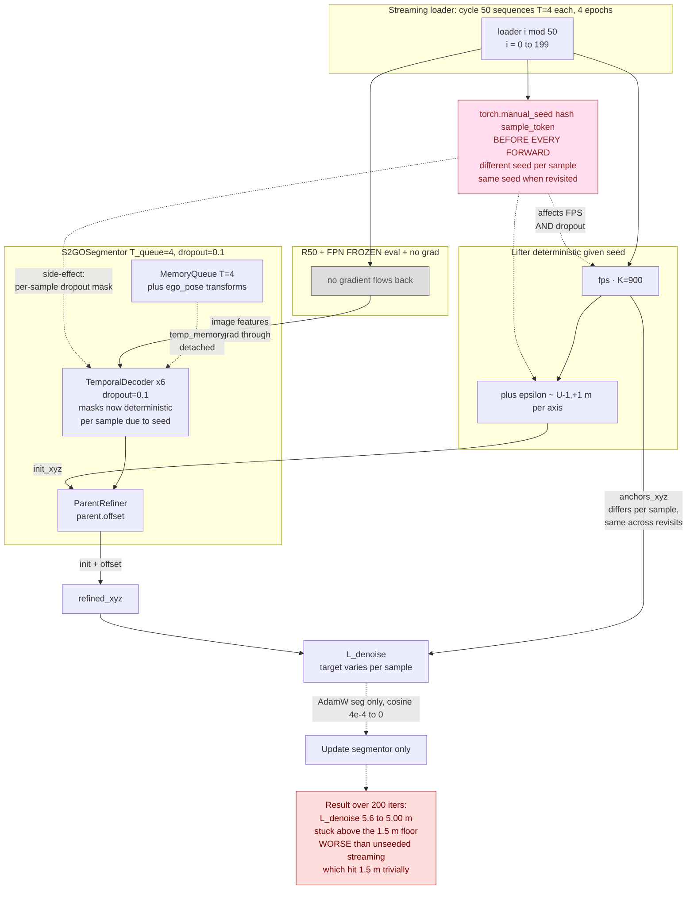
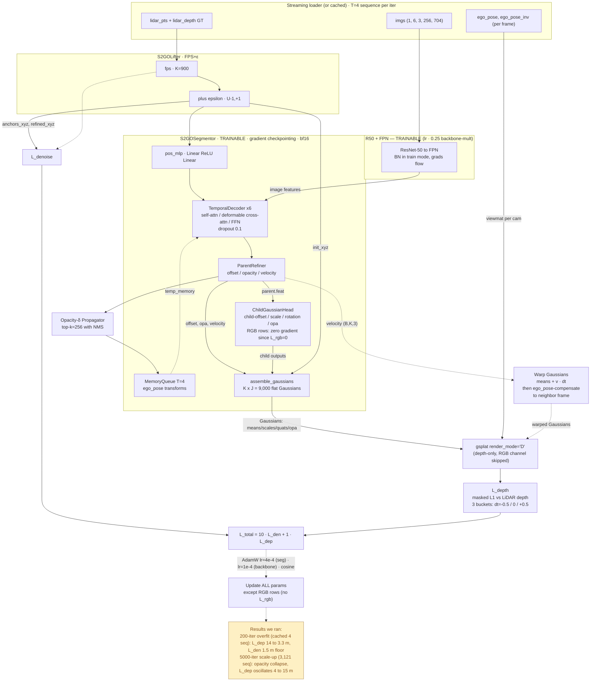
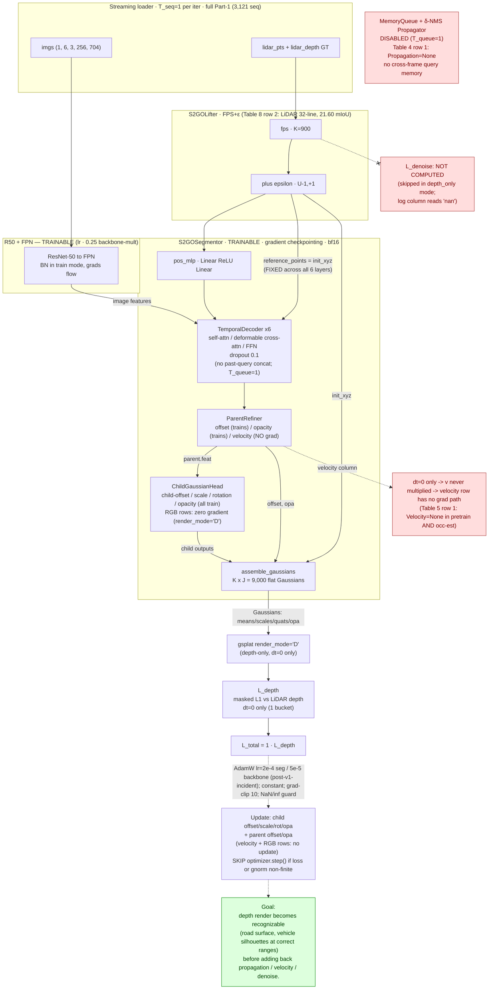
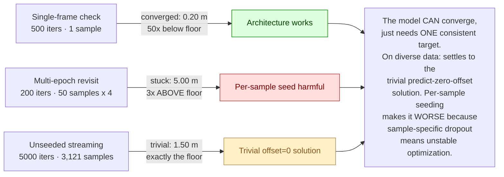

# Current training run architecture (`--denoise-only --freeze-backbone --full-data --limit-data 50`)

Diagram of what's actually being trained in the 50×4-epoch denoise-only run.

## Data flow & gradient flow



## Detailed ASCII view (per-module internals + tensor shapes)

For readers who want shapes, slice indices, and gradient routing in one
glance, the same flow rendered as ASCII art:

```
═══════════════════════════════════════════════════════════════════════════════════════════
INPUT (per frame t, 4 frames in sequence):
  imgs           : (1, 6, 3, 256, 704)   6 cameras × HW
  lidar_pts      : (1, M≈30k, 3)         LIDAR_TOP frame
  lidar2img      : (1, 6, 4, 4)
  ego_pose       : (1, 4, 4)             world ← lidar (loader stores ego-at-lidar-timestamp)
  ego_pose_inv   : (1, 4, 4)
  _sample_token  : string                used for FPS seeding
═══════════════════════════════════════════════════════════════════════════════════════════

  [imgs] ──────────────────────────────────────────────────┐
                                                           │
  ┌────────────── R50 + FPN  (FROZEN, eval mode) ──────────▼────────────────────────┐
  │                                                                                 │
  │   ResNet-50 (ImageNet1k init)                          ┌───────────────────┐    │
  │   conv1 → bn1 → relu → maxpool                         │ stage1: (B,256,…) │    │
  │   ↓                                                    │ stage2: (B,512,…) │    │
  │   layer1, layer2, layer3, layer4 ──── 4 outputs ───►   │ stage3: (B,1024,…)│    │
  │                                                        │ stage4: (B,2048,…)│    │
  │                                                        └────────┬──────────┘    │
  │                                                                 ▼               │
  │   FPN (mmdet, out_channels=768, num_outs=4)                                     │
  │   per-level lateral 1×1 conv + nearest-upsample + 3×3 smooth                    │
  │                                                                                 │
  │   feat_flatten: (B*N_cam=6, sum_HW=4×16×44+8×22+16×11=23,232, 768)              │
  │   spatial_shapes: (4, 2)   level_start_index: (4,)                              │
  └─────────────────────────────────┬───────────────────────────────────────────────┘
                                    │ image features (FROZEN — no grad flow back)
                                    │
  [lidar_pts] ──┐                   │
                ▼                   │
  ┌─── S2GOLifter (no params) ──┐   │
  │                             │   │
  │ torch_cluster.fps           │   │
  │  → K=900 anchors            │   │
  │ ε ∼ U(-1,+1)^(K×3)          │   │   ← per-iter manual_seed(hash(sample_token))
  │                             │   │     makes both FPS pick + ε deterministic per
  │ init_xyz = anchors + ε      │   │     sample (hypothesis-disproven; harms training)
  │ anchors_xyz (target)        │   │
  │                             │   │
  │ query_feat (B,K,768) = lifter.query_feat (learnable per-query embedding)
  └───────┬─────────────────────┘   │
          │init_xyz (B,K,3)         │
          │                         │
          ▼                         │
  ┌───── pos_mlp ─────┐             │
  │ Linear(3, 768)    │             │
  │ ReLU              │             │
  │ Linear(768, 768)  │             │
  └────────┬──────────┘             │
           │anchor_embed (B,K,768)  │
           │                        │
           ▼                        │
  ┌─────────────────────────────────────────────────────────────────────────────────┐
  │             TemporalDecoder (6 layers; gradient checkpointing on, bf16)         │
  │                                                                                 │
  │   loop over each frame t in T=4 sequence:                                       │
  │                                                                                 │
  │   per layer (× 6):                                                              │
  │   ┌─────────────────────────────────────────────────────────────────────────┐  │
  │   │                                                                          │  │
  │   │  TemporalSelfAttention (Flash attn)                                     │  │
  │   │  query'  ← concat[query, memory_embedding from queue]                   │  │
  │   │  q,k,v   = q_proj, k_proj, v_proj  (Linear 768→768, 12 heads × 64)     │  │
  │   │  attn    = flash_attn_func(q, k, v)                                     │  │
  │   │  sa_out  = out_proj(attn)                                               │  │
  │   │  query   ← LayerNorm(query + sa_out)                       [Add+Norm 1]│  │
  │   │                                                                          │  │
  │   │  DeformableCrossAttention   (ported from StreamPETR DeformableFeature-  │  │
  │   │                              AggregationCuda)                            │  │
  │   │   reference_points = init_xyz   (verified in segmentor.py:148;           │  │
  │   │     FIXED across all 6 decoder layers — NOT iteratively refined.         │  │
  │   │     parent.offset is applied AFTER the decoder returns, so the           │  │
  │   │     cross-attn always samples around the original FPS+ε positions.)      │  │
  │   │   per query × 6 cams × 4 levels × 13 sample points:                      │  │
  │   │     offsets       = sample_offset_net(query) → (..., 13, 2)              │  │
  │   │     weights       = weights_fc(query) → (..., 13)  ← INIT TO ZERO        │  │
  │   │     sample_points = lidar2img @ (reference_points + offsets·learned_xyz) │  │
  │   │     bilinear_sample(feat_flatten, sample_points) → (..., 768)            │  │
  │   │     attn_value    = sum(weights · sampled)                               │  │
  │   │   ca_out = learnable_fc(attn_value)                                      │  │
  │   │   query  ← LayerNorm(query + ca_out)                       [Add+Norm 2] │  │
  │   │                                                                          │  │
  │   │  FFN: Linear(768 → 3072) → ReLU → Dropout(0.1) → Linear(3072 → 768)    │  │
  │   │  query  ← LayerNorm(query + ffn_out)                       [Add+Norm 3]│  │
  │   │                                                                          │  │
  │   └─────────────────────────────────────────────────────────────────────────┘  │
  │                                                                                 │
  │   final query_feat: (B, K, 768)                                                 │
  └─────────────────────────────┬───────────────────────────────────────────────────┘
                                │
            ┌───────────────────┴─────────────────────┐
            │                                         │
            ▼                                         ▼
  ┌── ParentRefiner ─────────┐         ┌─── ChildGaussianHead ────┐
  │ trunk:                   │         │  expand: Linear(768,      │
  │  Linear(768,768)         │         │            J·768=7680)    │
  │  ReLU                    │         │  reshape → (B,K,J=10,768) │
  │  LayerNorm  } ×2 loops   │         │                           │
  │  Linear(768,768)         │         │  head: Linear(768, 14):   │   ← (unused in denoise-only:
  │  ReLU                    │         │    [0:3]  child offset    │      no signal reaches it,
  │  LayerNorm               │         │    [3:6]  scale (exp)     │      head receives zero
  │                          │         │    [6:10] rotation (quat) │      gradient. Kept in arch
  │ head: Linear(768, 7)     │         │    [10:11] opacity        │      for Stage-2 compatibility.)
  │  [0:3] offset            │         │    [11:14] RGB            │
  │   = (2·σ(x)-1)·unit_xyz  │         └───────────────────────────┘
  │   = bounded ±(4,4,1) m   │
  │  [3:4] opa  = sigmoid(x) │
  │  [4:7] velocity = raw    │
  │                          │
  │ Output: (offset,opa,v,feat)
  └──────┬───────────────────┘
         │ parent.offset (B,K,3)
         ▼
  refined_xyz = init_xyz + parent.offset   ◄──┐
                                              │
  ┌─── OpacityDeltaPropagator (no params) ─┐  │
  │ Sort queries by opacity (descending)   │  │
  │ Greedy NMS: keep top-k=256 with        │  │
  │  pairwise distance > δ                 │  │
  │  δ_train ∼ U(0, 3) m                   │  │
  │  δ_eval  = 1.6 m                       │  │
  │ Pad with next-highest opacity if       │  │
  │  fewer than k pass δ                   │  │
  └──────┬─────────────────────────────────┘  │
         │ Propagated(xyz, opa, feat, velo)   │
         ▼                                    │
  ┌─── MemoryQueue (stateful, no params) ──┐  │
  │ Buffers (init zeros):                  │  │
  │  memory_embedding:       (B, 1024, 768)│  │
  │  memory_reference_point: (B, 1024, 3)  │  │
  │  memory_egopose:         (B, 1024,4,4) │  │
  │  memory_velo:            (B, 1024, 3)  │  │
  │  memory_timestamp:       (B, 1024, 1)  │  │
  │                                        │  │
  │ pre_update (start of next frame):      │  │
  │   memory_reference_point ←             │  │
  │     ego_pose_n_inv @ memory_rp[world]  │  │
  │   memory_egopose ← ego_inv @ egopose   │  │
  │                                        │  │
  │ post_update (after current frame):     │  │
  │   push (prop.xyz @ ego_pose →world,    │  │
  │         prop.feat, prop.velo, ts)      │  │
  │   memory_embedding shifts FIFO (k=256) │  │
  │   keep last memory_len=T·k=1024 items  │  │
  └────────────┬───────────────────────────┘  │
               │ feeds memory_embedding back   │
               │ to next frame's TemporalSelfAttention via concat
               └─────────────────────────────────────────────────┘

                                                  │
                                                  ▼
                                    ┌─── L_denoise ────┐
                                    │  | anchors_xyz − │
                                    │    refined_xyz | │
                                    │  .sum(-1).mean() │
                                    └──────┬───────────┘
                                           │
                                           ▼
                                       L_total = 1·L_den + 0·L_dep + 0·L_rgb
                                                  │
                              ┌───────────────────┘
                              │ backward
                              ▼
═══════════════════════════════════════════════════════════════════════════════════════════
GRADIENT FLOW (denoise-only):

  L_denoise
    └─► refined_xyz  (B,K,3)
         └─► parent.offset
              └─► ParentRefiner.head.weight[0:3]   ← UPDATED  (offset rows only)
              └─► ParentRefiner.trunk              ← UPDATED  (whole MLP)
                   └─► query_feat
                        └─► TemporalDecoder.layers[0..5]     ← UPDATED  (all 6)
                             ├─► self_attn.{q,k,v,out}_proj  ← UPDATED
                             ├─► cross_attn (deformable)     ← UPDATED  (incl. weights_fc which is init=0)
                             ├─► ffn.[Linear→Linear]         ← UPDATED
                             └─► all LayerNorms              ← UPDATED
                        └─► anchor_embed
                             └─► pos_mlp                     ← UPDATED  (small grad)
                        └─► temp_memory (from queue)
                             └─► NO GRAD (queue stores .detach()ed feats)
                        └─► feat_flatten (image features)
                             └─► R50+FPN                     ← FROZEN (no grad)

  NOT UPDATED (zero gradient):
    ParentRefiner.head.weight[3:4]   (opa rows)        — opa unused in L_denoise
    ParentRefiner.head.weight[4:7]   (velocity rows)   — velocity unused (no warps)
    ChildGaussianHead.expand         (768→7680)        — no path from L_denoise
    ChildGaussianHead.head           (768→14)          — no path from L_denoise
    R50 + FPN (backbone)             (~47.5 M params)  — explicit freeze
═══════════════════════════════════════════════════════════════════════════════════════════
```

## What's active per box

| Component | Trainable in this run? | Why |
|---|---|---|
| **R50 backbone + FPN** | ❌ frozen | `--freeze-backbone`: `eval()` + `requires_grad=False`, **not** in optimizer |
| **S2GOLifter (FPS + ε)** | ❌ no params anyway | Pure deterministic ops; seeded by sample token |
| **pos_mlp (anchor_embed)** | ✅ trains | Receives gradient through anchor_embed in decoder input |
| **Temporal decoder (6 layers)** | ✅ trains | Self-attn + deformable cross-attn + FFN. Uses image features from frozen backbone, but its own params train |
| **MemoryQueue** | ❌ stateful, no params | Buffer only; ego-pose transforms applied per frame |
| **ParentRefiner** | ✅ trains (partially) | Only the **offset rows (0:3)** receive gradient. Opacity (row 3) and velocity (rows 4:7) get zero signal in denoise-only mode |
| **ChildGaussianHead** | ✅ trains, but zero signal | The full 14-dim head exists but L_denoise never reaches it — `refined_xyz` only uses parent offset |
| **assemble_gaussians** | n/a | Skipped entirely (no render) |
| **OpacityDeltaPropagator** | ❌ no params | Greedy NMS — pure compute |

## Loss path (denoise-only)

```
L_total = 1.0·L_denoise  +  0·L_depth  +  0·L_rgb
        = mean_query | FPS(pts) − (init_xyz + parent.offset) |
```

Only the **first term** is active. The renders are completely skipped via the `denoise_only` fast path in `compute_stage1_loss`.

## Gradient receivers (what AdamW updates each step)

In order of expected gradient magnitude on a converged training step:

1. `parent_refiner.head.weight[0:3]` + bias[0:3] — the offset slice
2. `parent_refiner.trunk` — MLP feeding the head
3. `decoder.layers[0..5]` — temporal decoder layers (all weights)
4. `pos_mlp` — small (only affects anchor_embed early in pipeline)

Receiving **zero gradient** (intentionally):
- `backbone.*` (frozen)
- `parent_refiner.head.weight[3:4]` (opa rows — opacity unused in loss)
- `parent_refiner.head.weight[4:7]` (velocity rows — no warps)
- All of `child_head.*` (no path from L_denoise to child outputs)

## Run config snapshot

| Knob | Value |
|---|---|
| K, J | 900, 10 |
| embed_dims | 768 |
| num_layers | 6 |
| num_pts (deformable cross-attn) | 13 |
| feedforward_channels | 3072 |
| T_queue | 4 |
| Image size | 256×704 |
| ε | U(−1, +1) per axis |
| Mixed precision | bf16 autocast |
| Gradient checkpointing | on (decoder layers) |
| Optimizer | AdamW, lr=4e-4, wd=0.01 |
| LR schedule | cosine, T_max=200 |
| Grad clip | max_norm=35 |
| Batch | 1 |
| Effective dataset | 50 sequences (--limit-data 50) |
| Iters | 200 (= 4 epochs over 50 samples) |
| FPS seed | `torch.manual_seed(hash(sample_token))` before each forward |
| Memory peak | ~2.9 GB (no render activations) |

---

# Companion: the two diagnostic experiments

Two complementary tests were run to localize the failure. The single-frame
check **converged** (architecture works); the multi-epoch revisit test
**failed** (per-sample seeding doesn't fix streaming convergence).

## Diagram 1 — Single-frame check (`denoise_only_check.py`) — CONVERGED ✓



**Why this converged:**

| Property | Value | Why it matters |
|---|---|---|
| Data | **1 fixed frame** | Anchor target is bit-identical every iter (cached on GPU, no FPS jitter) |
| T_queue | **1** | Temporal queue is trivial — no propagation, no `ego_pose` transforms |
| Dropout | **0.0** in decoder | Deterministic forward — same input → same output every iter |
| FPS seed | `manual_seed(42)` constant | Even if FPS were random, seed makes it deterministic |
| LR | constant 1e-4, no schedule | No decay to disrupt convergence |
| Backbone | eval mode, **still trainable** | Helps fit this single sample's image features |

This is the **standard ML "can the model overfit one example" sanity test**. It
passes — confirms the architecture, loss, and gradient flow are wired correctly.

## Diagram 2 — Hypothesis test (50 samples × 4 epochs, per-sample FPS seed) — DID NOT CONVERGE ✗



**Why this failed:**

| Property | Value | Why it matters |
|---|---|---|
| Data | **50 unique sequences**, each seen 4× | Per-sample anchors are stable across revisits — the hypothesis condition |
| T_queue | **4** | Full temporal queue active — ego_pose transforms in play |
| Dropout | **0.1** (default) in decoder | With `manual_seed` per-sample, dropout pattern is **deterministic but sample-specific** — prevents averaging across iters |
| FPS seed | `hash(sample_token)` | Same sample → same anchors, but **different samples have different patterns of stochasticity** |
| LR | cosine 4e-4 → 0 | LR decay disrupts late convergence |
| Backbone | **frozen** | Less optimization noise, but also removes a degree of freedom |

**Side-effect of `torch.manual_seed`:** it resets **all** global RNG — not just
FPS. So in this run, each sample also gets a unique deterministic dropout mask
in the temporal decoder. The model can no longer find a stable forward pass
that works "on average" — every sample is effectively a different sub-network.

## Diagram 3 — First-pass recipe (depth + denoise + warps, NO RGB) — the 200-iter and 5000-iter runs

This is the configuration whose checkpoints we actually evaluated (the
recipe decided in [Stage1_design.md §11.6](../../Stage1_design.md)). Differs
from the denoise-only diagnostic above: backbone is **trainable**, render
path is **active** (depth-only), warps are **on**, and 5 more loss
pathways are wired (depth-t0, depth-minus, depth-plus, denoise, plus
velocity-supervision through warps).



**What's different from the denoise-only diagram:**

| Component | Denoise-only (current run) | First-pass recipe (this diagram) |
|---|---|---|
| Backbone training | frozen (`--freeze-backbone`) | **trainable** (lr × 0.25 mult) |
| Render path | **skipped entirely** | active (`render_mode='D'`, RGB channel skipped) |
| ±0.5s warps | off | **on** (3 buckets: dt=-0.5 / 0 / +0.5) |
| L_depth | λ=0 | λ=1 |
| L_rgb | λ=0 | λ=0 (recipe drop) |
| Velocity head | zero gradient | **supervised** via warps |
| Opacity head (parent + child) | zero gradient | **supervised** via render alpha |
| Scale head | zero gradient | **supervised** via render footprint |
| ChildGaussianHead | zero signal | **fully active** (except RGB rows) |
| assemble_gaussians | skipped | active |
| Memory peak | ~2.9 GB | ~9.8 GB |
| Per-iter wall | ~2.0 s | ~2.6 s |

**Why depth alone produces good results in paper Table 3:**

- Row (e) in [tables.md](../../tables.md) — LiDAR+ε init, depth ✓, RGB ✗, denoise ✗ → **20.25 mIoU**
- Row (f) — same plus denoise → 21.60 mIoU (+1.05)
- Row (d) — same as (e) plus RGB instead of denoise → 20.55 mIoU (+0.30)

The **depth-only term carries ~94% of the pretraining gain** (jumping from
the no-pretrain baseline ~13 mIoU to row (e) 20.25). Denoise adds +1 mIoU
on top; RGB adds +0.3. Our recipe (depth + denoise, no RGB) sits between
rows (e) and (f) — interpolating to ~21.3 mIoU at full paper-scale.

**The observed failure modes on this recipe:**
- 200-iter overfit-4: works well (L_dep 14→3.3 m, depth structure clearly visible in renders)
- 5000-iter streaming: **opacity collapse** (mean 0.26 → 0.06), L_dep oscillates wildly (4–15 m)
- L_denoise on both runs: pinned at the 1.5 m noise floor

This is what motivated the denoise-only isolation diagnostic — to figure
out whether the opacity collapse is a downstream symptom of broken position
learning, or its own pathology. The companion experiments below help
narrow that down.

## Diagram 4 — Barebones recipe (`--barebones`) — paper Table 3 ablation 1 + Table 4 row 1 + Table 5 row 1

The current training plan. Strips the recipe down to **the single loss term
plus the simplest possible architectural config**:

- **Loss**: only L_depth at dt=0 (paper Table 3 row e — 20.25 mIoU, ~94% of the pretraining gain)
- **Propagation**: **None** (paper Table 4 row 1 — 17.92 mIoU baseline). `T_queue=1`, no cross-frame memory.
- **Velocity**: **None in both pretrain and occ-est** (paper Table 5 row 1 — 20.07 mIoU baseline). No warps → velocity head structurally unreachable; Stage 2 not built.
- **Sequence**: **T_seq=1** (single frame per sample). No temporal context, no memory queue lookback.
- **Query init**: **LiDAR (32-line) + ε** (paper Table 8 row 2 — 21.60 mIoU, tied with best). Already implemented in `S2GOLifter`; switching to other rows (occupied voxel, 16-line LiDAR, RGB depth) costs implementation work without meaningful mIoU upside (spread across all four rows is only 0.62 mIoU).

`L_denoise` is not computed at all (the `den_loss` call is skipped entirely; the
`L_den` column in the train log reads `nan`); no L_rgb; no ±0.5s warps. Velocity
row is structurally unreachable from the loss because v never multiplies a
non-zero dt.

**Why barebones first:** with every paper option turned off, anything that goes
wrong is attributable to the *single* remaining mechanism (depth render at dt=0
on a single frame). Once L_depth converges cleanly at this config, we add back
one piece at a time (propagation → T_queue=4; velocity → warps; etc.) and
measure each addition's contribution.

**This is now the implicit default.** Running

    python -m s2go.tools.overfit [non-recipe flags...]

with no recipe flag (no `--denoise-only`, `--depth-only`, `--barebones`, or
`--full-recipe`) gives barebones. The `--barebones` flag still exists as an
explicit alias for clarity. To opt OUT and run the paper-spec full Eq. 8
recipe (T_seq=4, T_queue=4, denoise + depth + rgb + ±0.5s warps), pass:

    python -m s2go.tools.overfit --full-recipe [non-recipe flags...]

Argparse defaults: `--t-seq=1`, `--t-queue=1`, `--lr-schedule constant`.
`--full-recipe` overrides t_seq/t_queue back to 4 (but keeps the constant
LR by default; pass `--lr-schedule cosine` explicitly for paper-spec).

**LR schedule note:** the default was switched from cosine to constant on
2026-05-12 after we discovered that `CosineAnnealingLR(T_max=n_iters)`
decays LR to *exactly 0* by the final iter, starving the model in the
last ~20 % of any short diagnostic run. Constant LR (held at peak for all
n_iters) avoids this. Use `--lr-schedule cosine --lr-min 1e-6` for full-
scale paper-style training where the cosine horizon matches the run
horizon.

**Goal:** depth render becomes recognizable on real frames — visible road
surface, vehicles silhouetted at correct ranges. This is the prerequisite
before adding back denoise/warps.



**Detailed ASCII view (barebones recipe — `--barebones`):**

```
═══════════════════════════════════════════════════════════════════════════════════════════
INPUT (single frame; T_seq=1, no temporal sequence):
  imgs           : (1, 6, 3, 256, 704)   6 cameras × HW
  lidar_pts      : (1, M≈30k, 3)         LIDAR_TOP frame
  lidar_depth    : (1, 6, 256, 704)      sparse LiDAR-projected depth GT (per cam)
  lidar2img      : (1, 6, 4, 4)
  cam_K, viewmats: (1, 6, 3, 3), (1, 6, 4, 4)   for gsplat render
  ego_pose       : (1, 4, 4)              (loaded but unused — no temporal warp/queue)
═══════════════════════════════════════════════════════════════════════════════════════════
Paper ablation mapping for this config:
  Table 3 row e  : depth ✓, RGB ✗, denoise ✗     →  20.25 mIoU
  Table 4 row 1  : Propagation = None            →  17.92 mIoU
  Table 5 row 1  : Pretrain ✗, Occ Est ✗         →  20.07 mIoU
  Table 8 row 2  : Query init = LiDAR (32-line)  →  21.60 mIoU (tied with best 21.61)
  (Barebones intersects rows 3/4/5 — the floor we're trying to first reproduce.
   Table 8 row 2 is our query-init source: full 32-line LiDAR sweep, FPS-sampled
   to K=900, plus ε ∼ U(-1,+1) m noise. Kept as the default because it is
   already implemented in S2GOLifter and is essentially tied with the
   best-scoring source — switching would add code complexity without
   meaningful mIoU upside.)
═══════════════════════════════════════════════════════════════════════════════════════════

  [imgs] ──────────────────────────────────────────────────┐
                                                           │
  ┌────────────── R50 + FPN  (TRAINABLE, lr × 0.25) ───────▼────────────────────────┐
  │   ResNet-50 (ImageNet1k init) + FPN (mmdet)                                     │
  │   feat_flatten: (B*6, 23,232, 768)                                              │
  │   spatial_shapes: (4, 2)   level_start_index: (4,)                              │
  │                                                                                 │
  │   Grads flow back through L_depth → render → query_feat → cross-attn → here.   │
  └─────────────────────────────────┬───────────────────────────────────────────────┘
                                    │ image features (grad flows back)
                                    │
  [lidar_pts] ──┐                   │
                ▼                   │
  ┌─── S2GOLifter (no params) ──┐   │
  │ fps → K=900 anchors         │   │
  │ ε ∼ U(-1,+1)^(K×3)          │   │
  │ init_xyz = anchors + ε      │   │
  │ anchors_xyz (unused here:   │   │
  │   no L_denoise computed)    │   │
  │ query_feat (B,K,768)        │   │
  └───────┬─────────────────────┘   │
          │init_xyz (B,K,3)         │
          ▼                         │
  ┌── pos_mlp ──┐                   │
  │ Linear-ReLU │                   │
  │ -Linear     │                   │
  └─────┬───────┘                   │
        │anchor_embed (B,K,768)     │
        ▼                           │
  ┌─────────────────────────────────────────────────────────────────────────────────┐
  │  TemporalDecoder (6 layers, gradient checkpointing, bf16)                       │
  │  per layer: SelfAttn(query)   → DeformableXAttn(feat_flatten) → FFN             │
  │              ▲                                                                  │
  │              └── NO past-query concat: T_queue=1 means the queue is empty       │
  │                  (Table 4 row 1: Propagation = None).                           │
  │  Grad flows through ALL params (self-attn projs, ca weights_fc, FFN, LNs).      │
  └─────────────────────────────┬───────────────────────────────────────────────────┘
                                │ query_feat (B, K, 768)
            ┌───────────────────┴─────────────────────┐
            ▼                                         ▼
  ┌── ParentRefiner ─────────┐         ┌─── ChildGaussianHead (ACTIVE) ──┐
  │ trunk (MLP, trains)      │         │  expand: Linear(768, J·768)     │
  │                          │         │  → (B,K,J=10,768)               │
  │ head: Linear(768, 7)     │         │  head: Linear(768, 14):         │
  │  [0:3] offset  ▲ TRAINS  │         │    [0:3]   child offset ▲ TRAINS│
  │  [3:4] opa     ▲ TRAINS  │         │    [3:6]   scale (exp)  ▲ TRAINS│
  │  [4:7] velocity ✗ NO grad│         │    [6:10]  rotation     ▲ TRAINS│
  │   (dt=0 always)          │         │    [10:11] opacity      ▲ TRAINS│
  └──────┬───────────────────┘         │    [11:14] RGB          ✗ NO grad
         │ offset, opa                 │           (render_mode='D' skips
         │                             │            color channel)        │
         ▼                             └─────────┬───────────────────────┘
  refined_xyz = init_xyz + parent.offset         │
         │                                       │
         ▼                                       ▼
  ┌──────── assemble_gaussians (K=900 × J=10 = 9,000 Gaussians) ──────────────┐
  │ means     = refined_xyz.unsqueeze(2) + child_offset                       │
  │ scales    = exp(child_scale)                                              │
  │ rotations = normalize(child_rot)        (quaternion)                      │
  │ opacities = sigmoid(parent_opa) · sigmoid(child_opa)                      │
  │ velocity  = parent_velocity              (used only if warps active)      │
  │ colors    = None                         (render_mode='D' → unused)       │
  └────────┬──────────────────────────────────────────────────────────────────┘
           │ Gaussians (B, K·J, …)
           ▼
  ┌──── gsplat.render (render_mode='D', dt=0 only) ──────────────────────────┐
  │ fully_fused_projection(means, scales, quats, viewmats, Ks) → 2D radii    │
  │ rasterize_to_pixels(...) → depth image (B, 6, 256, 704, 1)               │
  └────────┬─────────────────────────────────────────────────────────────────┘
           │ depth_pred (B, 6, 256, 704)
           ▼
  ┌──── DepthRenderLoss (masked L1 vs lidar_depth GT, dt=0 only) ─────────────┐
  │ mask = (lidar_depth > 0)                                                  │
  │ L_depth = |depth_pred - lidar_depth|[mask].mean()                         │
  └────────┬─────────────────────────────────────────────────────────────────┘
           │
           ▼
       L_total = 1 · L_depth        ← ONE and ONLY active term
       (L_den / L_rgb not computed; columns in log read 'nan')

  ┌─── L_denoise: NOT COMPUTED in depth_only mode ────────────────────────────┐
  │ den_loss(anchors_xyz, refined_xyz) is skipped entirely.                  │
  │ history['denoise'] = NaN; the L_den column in the train log reads 'nan'. │
  │ The anchors_xyz field is still produced by S2GOLifter but never read.    │
  └──────────────────────────────────────────────────────────────────────────┘

  ┌─── δ-NMS Propagator + MemoryQueue: DISABLED (barebones, T_queue=1) ───────┐
  │ T_queue=1 → memory_embedding / memory_reference_point buffers exist but  │
  │ are never populated with prior-frame propagated queries (T_seq=1 means   │
  │ no prior frame exists in this iter).                                     │
  │ The δ-NMS propagator still runs per-frame and emits prop.{xyz,opa,feat}, │
  │ but nothing downstream consumes its output across frames.                │
  │ Paper Table 4 row 1: Propagation = None.                                 │
  └──────────────────────────────────────────────────────────────────────────┘

═══════════════════════════════════════════════════════════════════════════════════════════
GRADIENT FLOW (barebones / depth-only):

  L_depth
    └─► depth_pred
         └─► gsplat.render
              ├─► means          (= refined_xyz + child_offset)
              │    ├─► parent.offset      → ParentRefiner.head[0:3]     ▲ UPDATED
              │    └─► child_offset       → ChildGaussianHead.head[0:3] ▲ UPDATED
              │         └─► expand + trunk → ChildGaussianHead trunk    ▲ UPDATED
              ├─► scales         → ChildGaussianHead.head[3:6]          ▲ UPDATED
              ├─► rotations      → ChildGaussianHead.head[6:10]         ▲ UPDATED
              └─► opacities      → ChildGaussianHead.head[10:11]        ▲ UPDATED
                                  + ParentRefiner.head[3:4]             ▲ UPDATED

         All paths flow back through query_feat:
              └─► TemporalDecoder.layers[0..5]   ← UPDATED (all 6 layers)
                   ├─► self_attn.{q,k,v,out}_proj
                   ├─► cross_attn (deformable)   ← incl. weights_fc (init=0)
                   ├─► ffn.[Linear→Linear]
                   └─► all LayerNorms
                   └─► feat_flatten (image features)
                        └─► R50 + FPN            ← UPDATED (lr · 0.25)

  NOT UPDATED (zero gradient — structurally unreachable):
    ParentRefiner.head.weight[4:7]    (velocity)    — dt=0 → v never multiplied
    ChildGaussianHead.head.weight[11:14] (RGB)       — render_mode='D' skips colors

  NOT COMPUTED at all in this recipe:
    L_denoise — den_loss call skipped; no forward, no graph, no log entry.
    L_rgb     — render_mode='D' has no color output; rgb_loss never invoked.
═══════════════════════════════════════════════════════════════════════════════════════════
```

**Head-by-head training status (in this recipe):**

| Head (row range) | Grad source | Status |
|---|---|---|
| `parent_refiner.head[0:3]` — parent offset | `means` via L_depth | **trains** |
| `parent_refiner.head[3:4]` — parent opacity | `opacities` via L_depth alpha | **trains** |
| `parent_refiner.head[4:7]` — velocity | `means + v·dt`, but dt=0 | **NO grad** ✗ |
| `child_head.head[0:3]` — child offset | `means` via L_depth | **trains** |
| `child_head.head[3:6]` — scale | render footprint | **trains** |
| `child_head.head[6:10]` — rotation | render footprint | **trains** |
| `child_head.head[10:11]` — child opacity | render alpha | **trains** |
| `child_head.head[11:14]` — RGB | `colors` skipped in `render_mode='D'` | **NO grad** ✗ |

Expected per-iter diagnostic signature: `gnorm_velocity ≈ 0` (same A/B
proof we used to validate `--no-warp`); `gnorm_rgb ≈ 0`; all other head
gnorms nonzero.

**Why start here (vs. Diagram 3 which adds denoise + warps):**

1. **Single loss term simplifies debugging.** If L_depth doesn't drop,
   there's exactly one pathway to inspect: render → depth target.
2. **Removes the denoise floor confound.** L_denoise plateauing at 1.5 m
   on diverse data (the "trivial offset=0" symptom from the 5000-iter
   run) was muddying earlier analysis. With L_denoise out of the
   objective entirely, we can see whether L_depth alone moves the
   Gaussian state into a useful regime.
3. **Paper Table 3 says this works.** Row (e) — depth-only — already
   reaches 20.25 mIoU. The remaining 1.4 mIoU is the marginal value of
   adding denoise + RGB. We should not chase those until row (e) is
   reproduced.
4. **Lowest memory.** No RGB channel render, no SSIM, no warp triple-
   render — should fit comfortably even without `--use-checkpoint`.

**What this recipe will not tell us:**
- Whether velocity supervision (Diagram 3's warps) actually helps mIoU —
  this is a separate ablation, run after L_depth converges.
- Whether the denoise floor is fundamental or just slow — also a follow-up.

## Side-by-side: why one worked, the other didn't



## The actual implication

The bug is **not** FPS jitter, not ego-pose composition, not opacity collapse
per se. The architecture has the capacity to overfit one frame (proven by
Diagram 1) but **on diverse streaming data**, the upstream blocks (decoder +
cross-attn) cannot reach a representation where the offset head can predict
correct per-scene offsets — each scene needs different offsets, and the model
hasn't trained on enough iters per sample to learn the mapping.

The 5000-iter scale-up settled at L_denoise = 1.5 m because that's the
analytical L_denoise when `parent.offset = 0` — the trivial "predict nothing"
solution. With per-sample seeding, even that trivial solution is unreachable
because the network is effectively different per sample.

**Implications:**

1. The 5000-iter scale-up wasn't a "bug" — it was the model converging to the
   easiest local minimum (offset=0) on diverse data without enough per-sample
   training.
2. **Real Stage-1 training needs many epochs on the full dataset** to let the
   decoder learn the image→geometry mapping that lets the offset head predict
   meaningful corrections.
3. The per-sample FPS seed is **harmful** and should be removed.
4. The path forward is **more epochs**, not more architectural diagnosis.

---

# Latest runs (chronological)

| Run dir | Iters | Data | LR | Final L_depth | Notes |
|---|---|---|---|---|---|
| [`out/depth_only_50iter/`](../depth_only_50iter/) | 50 | cached 4 seq (T_seq=4, T_queue=4) | cosine→0 (bug) | 3.09 m | Depth-only T2 baseline; before `--barebones` flag existed |
| [`out/depth_only_singleframe/`](../depth_only_singleframe/) | 500 | 1 fixed frame (T=1) | constant 1e-4 | **0.586 m** | Single-frame architecture-capacity test; confirmed depth pathway works |
| [`out/barebones_50iter/`](../barebones_50iter/) | 50 | cached 4 seq (T_seq=1, T_queue=1) | cosine→0 (bug) | 3.04 m | First barebones run; matches depth_only_50iter trajectory at 3.7× less wall + 56% less memory |
| [`out/barebones_500iter/`](../barebones_500iter/) | 500 | cached 4 seq (T_seq=1, T_queue=1) | cosine→0 (bug) | 1.94 m | First long barebones; broke past the 50-iter "plateau"; revealed the cosine→0 LR bug |
| [`out/barebones_full_part1_5000iter/`](../barebones_full_part1_5000iter/) ⚠ v1 | 5000 | streaming Part 1 (3,376 seq) | constant 1e-4, **grad-clip 35**, **no NaN guard** | 1.94 m best (iter 977), then **NaN-corrupted iter 3359→4999** | **First streaming barebones FAILED**. Hit bf16 gradient overflow in gsplat backward at iter 2907 → `inf` total gnorm at 2919 → `inf × (max/inf) = NaN` in bf16 grad-clip arithmetic at 3359. Final summary verdict "BAD" was a NaN-contamination artifact. |
| [`out/barebones_full_part1_5000iter_v2/`](../barebones_full_part1_5000iter_v2/) ✓ v2 | 5000 | streaming Part 1 (3,376 seq) | constant **2e-4** (halved), **grad-clip 10** (tightened), **NaN/inf guard ON** | **2.45 m best (iter 2300)**, 4.42 m at iter 4999, 0 skips | **Clean run.** Passed the v1 iter-2919 explosion zone with zero incidents. Lowest L_depth comparable to v1's pre-explosion best (2.37 m at iter 977) but reached *and held* without instability. Saved usable 413 MB checkpoint. |

**Eval comparison — 500-iter cached vs 5000-iter v2 streaming:**

| Metric | 500-iter cached (4 seq) | 5000-iter v2 (3,376 seq) | Δ | Interpretation |
|---|---|---|---|---|
| Nearest-LiDAR distance (mean) | 2.21 m | 2.44 m | +0.23 m | similar — generalization holding |
| Opacity max | 0.94 | 0.74 | **−0.20** | v2 never gets near-saturated; expected when balancing 3k scenes |
| Scale L2 distribution | bimodal (0.3 m + 2.5 m peaks) | broader unimodal (0.4–3.4 m) | — | v2 lost the explicit parent/child scale separation |
| **topk_opacity mean** | **0.985** | **0.519** | **−0.47** | survivors less authoritative on diverse data |
| Rendered depth range | [0, 70 m] | [0, 63 m] | -7 m | both span scene scale, no degenerate constant |

**Implicit recipe evolution:**
- 2026-05-11: T_seq=4, T_queue=4, depth+denoise+warps, cosine→0 LR
- 2026-05-12 (early): T_seq=1, T_queue=1, depth-only, constant LR — barebones default (Table 3 row e + Table 4 row 1 + Table 5 row 1 + Table 8 row 2)
- 2026-05-12 (after v1 failure): **lr 4e-4 → 2e-4, grad-clip 35 → 10, NaN/inf guard added**. See "v1 vs v2" rows above. Skip-on-NaN behavior wired in [`overfit.py`](../../s2go/tools/overfit.py) at the train loop's clip step; logs `sample_token` of any skipped iter for offline triage.

**Hacks accumulated** (full text in [`hacks.md`](../../hacks.md)):
- H1: `torch_cluster.fps` non-deterministic without explicit seeding
- H2: Stage-1 architecture overfit is slow, not stuck — needs ≥500 iters per sample
- H3: LIDAR_TOP frame is **`+y` forward**, not `+x`
- H4: Python stdout block-buffers under nohup — use `PYTHONUNBUFFERED=1` + `python -u`
- (implicit "H5"): bf16 + unguarded grad clip can produce `NaN` from `inf × 0`; documented in v1 post-mortem above
