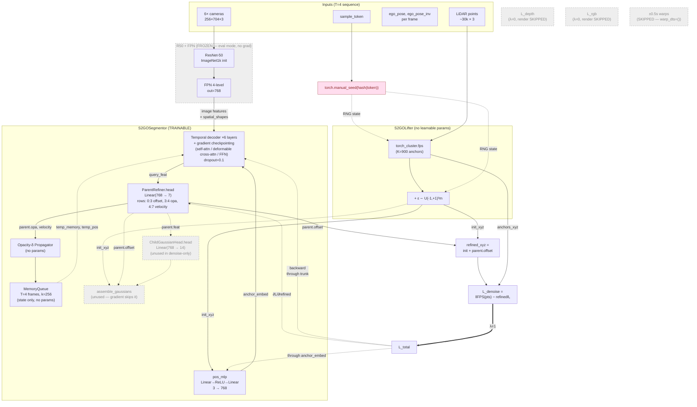
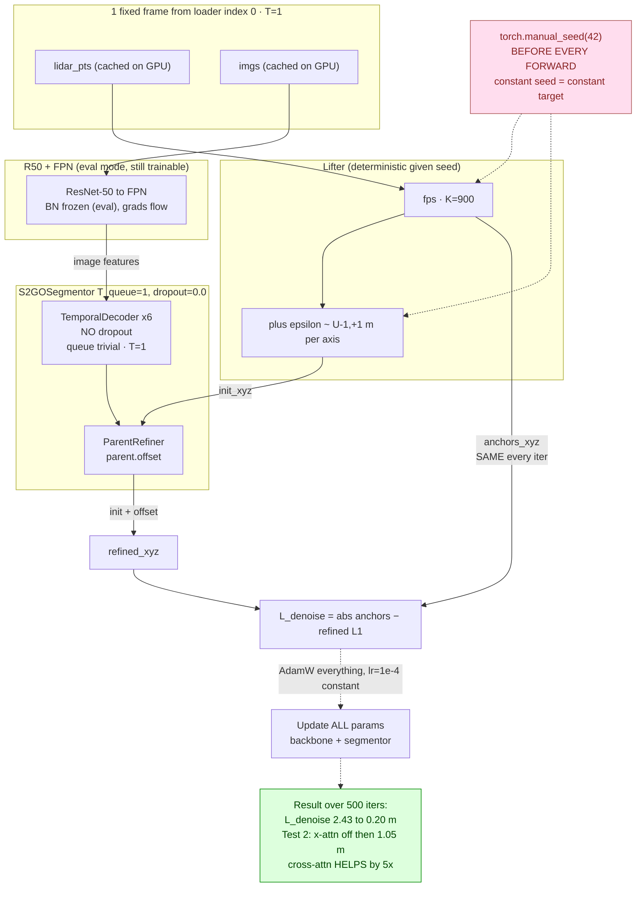
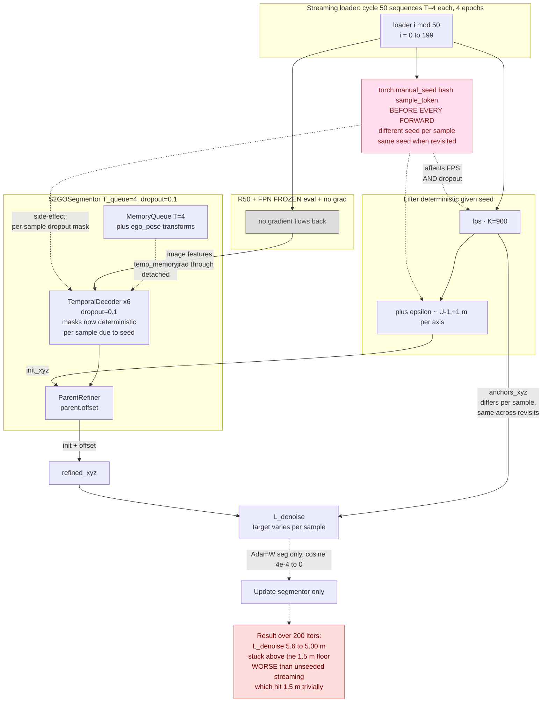
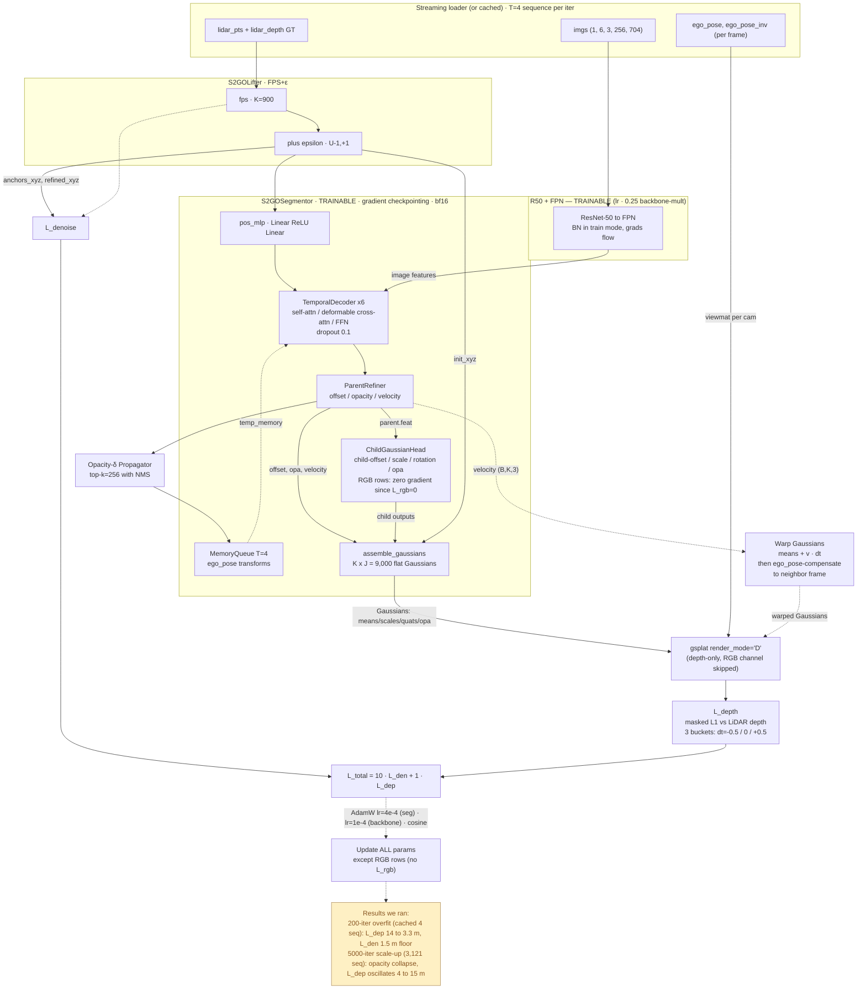
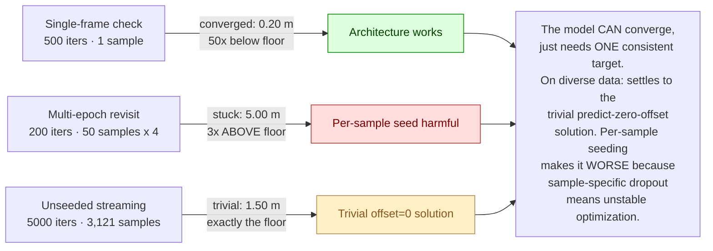

# Current training run architecture (`--denoise-only --freeze-backbone --full-data --limit-data 50`)

Diagram of what's actually being trained in the 50×4-epoch denoise-only run.

## Data flow & gradient flow



## Detailed ASCII view (per-module internals + tensor shapes)

For readers who want shapes, slice indices, and gradient routing in one
glance, the same flow rendered as ASCII art:

```
═══════════════════════════════════════════════════════════════════════════════════════════
INPUT (per frame t, 4 frames in sequence):
  imgs           : (1, 6, 3, 256, 704)   6 cameras × HW
  lidar_pts      : (1, M≈30k, 3)         LIDAR_TOP frame
  lidar2img      : (1, 6, 4, 4)
  ego_pose       : (1, 4, 4)             world ← lidar (loader stores ego-at-lidar-timestamp)
  ego_pose_inv   : (1, 4, 4)
  _sample_token  : string                used for FPS seeding
═══════════════════════════════════════════════════════════════════════════════════════════

  [imgs] ──────────────────────────────────────────────────┐
                                                           │
  ┌────────────── R50 + FPN  (FROZEN, eval mode) ──────────▼────────────────────────┐
  │                                                                                 │
  │   ResNet-50 (ImageNet1k init)                          ┌───────────────────┐    │
  │   conv1 → bn1 → relu → maxpool                         │ stage1: (B,256,…) │    │
  │   ↓                                                    │ stage2: (B,512,…) │    │
  │   layer1, layer2, layer3, layer4 ──── 4 outputs ───►   │ stage3: (B,1024,…)│    │
  │                                                        │ stage4: (B,2048,…)│    │
  │                                                        └────────┬──────────┘    │
  │                                                                 ▼               │
  │   FPN (mmdet, out_channels=768, num_outs=4)                                     │
  │   per-level lateral 1×1 conv + nearest-upsample + 3×3 smooth                    │
  │                                                                                 │
  │   feat_flatten: (B*N_cam=6, sum_HW=4×16×44+8×22+16×11=23,232, 768)              │
  │   spatial_shapes: (4, 2)   level_start_index: (4,)                              │
  └─────────────────────────────────┬───────────────────────────────────────────────┘
                                    │ image features (FROZEN — no grad flow back)
                                    │
  [lidar_pts] ──┐                   │
                ▼                   │
  ┌─── S2GOLifter (no params) ──┐   │
  │                             │   │
  │ torch_cluster.fps           │   │
  │  → K=900 anchors            │   │
  │ ε ∼ U(-1,+1)^(K×3)          │   │   ← per-iter manual_seed(hash(sample_token))
  │                             │   │     makes both FPS pick + ε deterministic per
  │ init_xyz = anchors + ε      │   │     sample (hypothesis-disproven; harms training)
  │ anchors_xyz (target)        │   │
  │                             │   │
  │ query_feat (B,K,768) = lifter.query_feat (learnable per-query embedding)
  └───────┬─────────────────────┘   │
          │init_xyz (B,K,3)         │
          │                         │
          ▼                         │
  ┌───── pos_mlp ─────┐             │
  │ Linear(3, 768)    │             │
  │ ReLU              │             │
  │ Linear(768, 768)  │             │
  └────────┬──────────┘             │
           │anchor_embed (B,K,768)  │
           │                        │
           ▼                        │
  ┌─────────────────────────────────────────────────────────────────────────────────┐
  │             TemporalDecoder (6 layers; gradient checkpointing on, bf16)         │
  │                                                                                 │
  │   loop over each frame t in T=4 sequence:                                       │
  │                                                                                 │
  │   per layer (× 6):                                                              │
  │   ┌─────────────────────────────────────────────────────────────────────────┐  │
  │   │                                                                          │  │
  │   │  TemporalSelfAttention (Flash attn)                                     │  │
  │   │  query'  ← concat[query, memory_embedding from queue]                   │  │
  │   │  q,k,v   = q_proj, k_proj, v_proj  (Linear 768→768, 12 heads × 64)     │  │
  │   │  attn    = flash_attn_func(q, k, v)                                     │  │
  │   │  sa_out  = out_proj(attn)                                               │  │
  │   │  query   ← LayerNorm(query + sa_out)                       [Add+Norm 1]│  │
  │   │                                                                          │  │
  │   │  DeformableCrossAttention   (ported from StreamPETR DeformableFeature-  │  │
  │   │                              AggregationCuda)                            │  │
  │   │   reference_points = refined_xyz                                         │  │
  │   │   per query × 6 cams × 4 levels × 13 sample points:                      │  │
  │   │     offsets       = sample_offset_net(query) → (..., 13, 2)              │  │
  │   │     weights       = weights_fc(query) → (..., 13)  ← INIT TO ZERO        │  │
  │   │     sample_points = lidar2img @ (reference_points + offsets·learned_xyz) │  │
  │   │     bilinear_sample(feat_flatten, sample_points) → (..., 768)            │  │
  │   │     attn_value    = sum(weights · sampled)                               │  │
  │   │   ca_out = learnable_fc(attn_value)                                      │  │
  │   │   query  ← LayerNorm(query + ca_out)                       [Add+Norm 2] │  │
  │   │                                                                          │  │
  │   │  FFN: Linear(768 → 3072) → ReLU → Dropout(0.1) → Linear(3072 → 768)    │  │
  │   │  query  ← LayerNorm(query + ffn_out)                       [Add+Norm 3]│  │
  │   │                                                                          │  │
  │   └─────────────────────────────────────────────────────────────────────────┘  │
  │                                                                                 │
  │   final query_feat: (B, K, 768)                                                 │
  └─────────────────────────────┬───────────────────────────────────────────────────┘
                                │
            ┌───────────────────┴─────────────────────┐
            │                                         │
            ▼                                         ▼
  ┌── ParentRefiner ─────────┐         ┌─── ChildGaussianHead ────┐
  │ trunk:                   │         │  expand: Linear(768,      │
  │  Linear(768,768)         │         │            J·768=7680)    │
  │  ReLU                    │         │  reshape → (B,K,J=10,768) │
  │  LayerNorm  } ×2 loops   │         │                           │
  │  Linear(768,768)         │         │  head: Linear(768, 14):   │   ← (unused in denoise-only:
  │  ReLU                    │         │    [0:3]  child offset    │      no signal reaches it,
  │  LayerNorm               │         │    [3:6]  scale (exp)     │      head receives zero
  │                          │         │    [6:10] rotation (quat) │      gradient. Kept in arch
  │ head: Linear(768, 7)     │         │    [10:11] opacity        │      for Stage-2 compatibility.)
  │  [0:3] offset            │         │    [11:14] RGB            │
  │   = (2·σ(x)-1)·unit_xyz  │         └───────────────────────────┘
  │   = bounded ±(4,4,1) m   │
  │  [3:4] opa  = sigmoid(x) │
  │  [4:7] velocity = raw    │
  │                          │
  │ Output: (offset,opa,v,feat)
  └──────┬───────────────────┘
         │ parent.offset (B,K,3)
         ▼
  refined_xyz = init_xyz + parent.offset   ◄──┐
                                              │
  ┌─── OpacityDeltaPropagator (no params) ─┐  │
  │ Sort queries by opacity (descending)   │  │
  │ Greedy NMS: keep top-k=256 with        │  │
  │  pairwise distance > δ                 │  │
  │  δ_train ∼ U(0, 3) m                   │  │
  │  δ_eval  = 1.6 m                       │  │
  │ Pad with next-highest opacity if       │  │
  │  fewer than k pass δ                   │  │
  └──────┬─────────────────────────────────┘  │
         │ Propagated(xyz, opa, feat, velo)   │
         ▼                                    │
  ┌─── MemoryQueue (stateful, no params) ──┐  │
  │ Buffers (init zeros):                  │  │
  │  memory_embedding:       (B, 1024, 768)│  │
  │  memory_reference_point: (B, 1024, 3)  │  │
  │  memory_egopose:         (B, 1024,4,4) │  │
  │  memory_velo:            (B, 1024, 3)  │  │
  │  memory_timestamp:       (B, 1024, 1)  │  │
  │                                        │  │
  │ pre_update (start of next frame):      │  │
  │   memory_reference_point ←             │  │
  │     ego_pose_n_inv @ memory_rp[world]  │  │
  │   memory_egopose ← ego_inv @ egopose   │  │
  │                                        │  │
  │ post_update (after current frame):     │  │
  │   push (prop.xyz @ ego_pose →world,    │  │
  │         prop.feat, prop.velo, ts)      │  │
  │   memory_embedding shifts FIFO (k=256) │  │
  │   keep last memory_len=T·k=1024 items  │  │
  └────────────┬───────────────────────────┘  │
               │ feeds memory_embedding back   │
               │ to next frame's TemporalSelfAttention via concat
               └─────────────────────────────────────────────────┘

                                                  │
                                                  ▼
                                    ┌─── L_denoise ────┐
                                    │  | anchors_xyz − │
                                    │    refined_xyz | │
                                    │  .sum(-1).mean() │
                                    └──────┬───────────┘
                                           │
                                           ▼
                                       L_total = 1·L_den + 0·L_dep + 0·L_rgb
                                                  │
                              ┌───────────────────┘
                              │ backward
                              ▼
═══════════════════════════════════════════════════════════════════════════════════════════
GRADIENT FLOW (denoise-only):

  L_denoise
    └─► refined_xyz  (B,K,3)
         └─► parent.offset
              └─► ParentRefiner.head.weight[0:3]   ← UPDATED  (offset rows only)
              └─► ParentRefiner.trunk              ← UPDATED  (whole MLP)
                   └─► query_feat
                        └─► TemporalDecoder.layers[0..5]     ← UPDATED  (all 6)
                             ├─► self_attn.{q,k,v,out}_proj  ← UPDATED
                             ├─► cross_attn (deformable)     ← UPDATED  (incl. weights_fc which is init=0)
                             ├─► ffn.[Linear→Linear]         ← UPDATED
                             └─► all LayerNorms              ← UPDATED
                        └─► anchor_embed
                             └─► pos_mlp                     ← UPDATED  (small grad)
                        └─► temp_memory (from queue)
                             └─► NO GRAD (queue stores .detach()ed feats)
                        └─► feat_flatten (image features)
                             └─► R50+FPN                     ← FROZEN (no grad)

  NOT UPDATED (zero gradient):
    ParentRefiner.head.weight[3:4]   (opa rows)        — opa unused in L_denoise
    ParentRefiner.head.weight[4:7]   (velocity rows)   — velocity unused (no warps)
    ChildGaussianHead.expand         (768→7680)        — no path from L_denoise
    ChildGaussianHead.head           (768→14)          — no path from L_denoise
    R50 + FPN (backbone)             (~47.5 M params)  — explicit freeze
═══════════════════════════════════════════════════════════════════════════════════════════
```

## What's active per box

| Component | Trainable in this run? | Why |
|---|---|---|
| **R50 backbone + FPN** | ❌ frozen | `--freeze-backbone`: `eval()` + `requires_grad=False`, **not** in optimizer |
| **S2GOLifter (FPS + ε)** | ❌ no params anyway | Pure deterministic ops; seeded by sample token |
| **pos_mlp (anchor_embed)** | ✅ trains | Receives gradient through anchor_embed in decoder input |
| **Temporal decoder (6 layers)** | ✅ trains | Self-attn + deformable cross-attn + FFN. Uses image features from frozen backbone, but its own params train |
| **MemoryQueue** | ❌ stateful, no params | Buffer only; ego-pose transforms applied per frame |
| **ParentRefiner** | ✅ trains (partially) | Only the **offset rows (0:3)** receive gradient. Opacity (row 3) and velocity (rows 4:7) get zero signal in denoise-only mode |
| **ChildGaussianHead** | ✅ trains, but zero signal | The full 14-dim head exists but L_denoise never reaches it — `refined_xyz` only uses parent offset |
| **assemble_gaussians** | n/a | Skipped entirely (no render) |
| **OpacityDeltaPropagator** | ❌ no params | Greedy NMS — pure compute |

## Loss path (denoise-only)

```
L_total = 1.0·L_denoise  +  0·L_depth  +  0·L_rgb
        = mean_query | FPS(pts) − (init_xyz + parent.offset) |
```

Only the **first term** is active. The renders are completely skipped via the `denoise_only` fast path in `compute_stage1_loss`.

## Gradient receivers (what AdamW updates each step)

In order of expected gradient magnitude on a converged training step:

1. `parent_refiner.head.weight[0:3]` + bias[0:3] — the offset slice
2. `parent_refiner.trunk` — MLP feeding the head
3. `decoder.layers[0..5]` — temporal decoder layers (all weights)
4. `pos_mlp` — small (only affects anchor_embed early in pipeline)

Receiving **zero gradient** (intentionally):
- `backbone.*` (frozen)
- `parent_refiner.head.weight[3:4]` (opa rows — opacity unused in loss)
- `parent_refiner.head.weight[4:7]` (velocity rows — no warps)
- All of `child_head.*` (no path from L_denoise to child outputs)

## Run config snapshot

| Knob | Value |
|---|---|
| K, J | 900, 10 |
| embed_dims | 768 |
| num_layers | 6 |
| num_pts (deformable cross-attn) | 13 |
| feedforward_channels | 3072 |
| T_queue | 4 |
| Image size | 256×704 |
| ε | U(−1, +1) per axis |
| Mixed precision | bf16 autocast |
| Gradient checkpointing | on (decoder layers) |
| Optimizer | AdamW, lr=4e-4, wd=0.01 |
| LR schedule | cosine, T_max=200 |
| Grad clip | max_norm=35 |
| Batch | 1 |
| Effective dataset | 50 sequences (--limit-data 50) |
| Iters | 200 (= 4 epochs over 50 samples) |
| FPS seed | `torch.manual_seed(hash(sample_token))` before each forward |
| Memory peak | ~2.9 GB (no render activations) |

---

# Companion: the two diagnostic experiments

Two complementary tests were run to localize the failure. The single-frame
check **converged** (architecture works); the multi-epoch revisit test
**failed** (per-sample seeding doesn't fix streaming convergence).

## Diagram 1 — Single-frame check (`denoise_only_check.py`) — CONVERGED ✓



**Why this converged:**

| Property | Value | Why it matters |
|---|---|---|
| Data | **1 fixed frame** | Anchor target is bit-identical every iter (cached on GPU, no FPS jitter) |
| T_queue | **1** | Temporal queue is trivial — no propagation, no `ego_pose` transforms |
| Dropout | **0.0** in decoder | Deterministic forward — same input → same output every iter |
| FPS seed | `manual_seed(42)` constant | Even if FPS were random, seed makes it deterministic |
| LR | constant 1e-4, no schedule | No decay to disrupt convergence |
| Backbone | eval mode, **still trainable** | Helps fit this single sample's image features |

This is the **standard ML "can the model overfit one example" sanity test**. It
passes — confirms the architecture, loss, and gradient flow are wired correctly.

## Diagram 2 — Hypothesis test (50 samples × 4 epochs, per-sample FPS seed) — DID NOT CONVERGE ✗



**Why this failed:**

| Property | Value | Why it matters |
|---|---|---|
| Data | **50 unique sequences**, each seen 4× | Per-sample anchors are stable across revisits — the hypothesis condition |
| T_queue | **4** | Full temporal queue active — ego_pose transforms in play |
| Dropout | **0.1** (default) in decoder | With `manual_seed` per-sample, dropout pattern is **deterministic but sample-specific** — prevents averaging across iters |
| FPS seed | `hash(sample_token)` | Same sample → same anchors, but **different samples have different patterns of stochasticity** |
| LR | cosine 4e-4 → 0 | LR decay disrupts late convergence |
| Backbone | **frozen** | Less optimization noise, but also removes a degree of freedom |

**Side-effect of `torch.manual_seed`:** it resets **all** global RNG — not just
FPS. So in this run, each sample also gets a unique deterministic dropout mask
in the temporal decoder. The model can no longer find a stable forward pass
that works "on average" — every sample is effectively a different sub-network.

## Diagram 3 — First-pass recipe (depth + denoise + warps, NO RGB) — the 200-iter and 5000-iter runs

This is the configuration whose checkpoints we actually evaluated (the
recipe decided in [Stage1_design.md §11.6](../../Stage1_design.md)). Differs
from the denoise-only diagnostic above: backbone is **trainable**, render
path is **active** (depth-only), warps are **on**, and 5 more loss
pathways are wired (depth-t0, depth-minus, depth-plus, denoise, plus
velocity-supervision through warps).



**What's different from the denoise-only diagram:**

| Component | Denoise-only (current run) | First-pass recipe (this diagram) |
|---|---|---|
| Backbone training | frozen (`--freeze-backbone`) | **trainable** (lr × 0.25 mult) |
| Render path | **skipped entirely** | active (`render_mode='D'`, RGB channel skipped) |
| ±0.5s warps | off | **on** (3 buckets: dt=-0.5 / 0 / +0.5) |
| L_depth | λ=0 | λ=1 |
| L_rgb | λ=0 | λ=0 (recipe drop) |
| Velocity head | zero gradient | **supervised** via warps |
| Opacity head (parent + child) | zero gradient | **supervised** via render alpha |
| Scale head | zero gradient | **supervised** via render footprint |
| ChildGaussianHead | zero signal | **fully active** (except RGB rows) |
| assemble_gaussians | skipped | active |
| Memory peak | ~2.9 GB | ~9.8 GB |
| Per-iter wall | ~2.0 s | ~2.6 s |

**Why depth alone produces good results in paper Table 3:**

- Row (e) in [tables.md](../../tables.md) — LiDAR+ε init, depth ✓, RGB ✗, denoise ✗ → **20.25 mIoU**
- Row (f) — same plus denoise → 21.60 mIoU (+1.05)
- Row (d) — same as (e) plus RGB instead of denoise → 20.55 mIoU (+0.30)

The **depth-only term carries ~94% of the pretraining gain** (jumping from
the no-pretrain baseline ~13 mIoU to row (e) 20.25). Denoise adds +1 mIoU
on top; RGB adds +0.3. Our recipe (depth + denoise, no RGB) sits between
rows (e) and (f) — interpolating to ~21.3 mIoU at full paper-scale.

**The observed failure modes on this recipe:**
- 200-iter overfit-4: works well (L_dep 14→3.3 m, depth structure clearly visible in renders)
- 5000-iter streaming: **opacity collapse** (mean 0.26 → 0.06), L_dep oscillates wildly (4–15 m)
- L_denoise on both runs: pinned at the 1.5 m noise floor

This is what motivated the denoise-only isolation diagnostic — to figure
out whether the opacity collapse is a downstream symptom of broken position
learning, or its own pathology. The companion experiments below help
narrow that down.

## Side-by-side: why one worked, the other didn't



## The actual implication

The bug is **not** FPS jitter, not ego-pose composition, not opacity collapse
per se. The architecture has the capacity to overfit one frame (proven by
Diagram 1) but **on diverse streaming data**, the upstream blocks (decoder +
cross-attn) cannot reach a representation where the offset head can predict
correct per-scene offsets — each scene needs different offsets, and the model
hasn't trained on enough iters per sample to learn the mapping.

The 5000-iter scale-up settled at L_denoise = 1.5 m because that's the
analytical L_denoise when `parent.offset = 0` — the trivial "predict nothing"
solution. With per-sample seeding, even that trivial solution is unreachable
because the network is effectively different per sample.

**Implications:**

1. The 5000-iter scale-up wasn't a "bug" — it was the model converging to the
   easiest local minimum (offset=0) on diverse data without enough per-sample
   training.
2. **Real Stage-1 training needs many epochs on the full dataset** to let the
   decoder learn the image→geometry mapping that lets the offset head predict
   meaningful corrections.
3. The per-sample FPS seed is **harmful** and should be removed.
4. The path forward is **more epochs**, not more architectural diagnosis.
