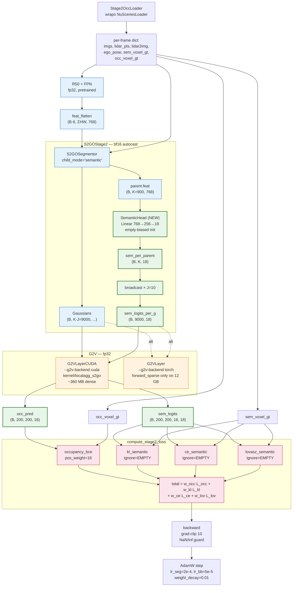

# S2GO Stage 2 — implementation summary

**Date:** 2026-05-13
**Scope:** semantic occupancy training (S2GO paper §3.4) as a self-contained module that consumes the Stage 1 stack without modifying it. Two runs reported here: torch-backend (sparse voxel sampling) and CUDA-backend (dense, via the compiled `local_aggregate_s2go` kernel).

---

## 1. Goal & constraints

Stage 2 adds **semantic occupancy prediction** on top of the Stage 1 Gaussian backbone:

- Per-Gaussian class logits → broadcast to all (K × J = 9000) Gaussians.
- Gaussian-to-Voxel (G2V) splatting → dense voxel-space outputs (occupancy + class).
- Voxel-space loss → mIoU + occupancy IoU at eval.

**User-imposed constraints (locked in by Q&A at the start):**

| Decision | Choice |
|---|---|
| File layout | All new files live in `s2go/stage2/` and `s2go/tools/`; **zero edits to Stage 1** |
| Loss formulation | KL + CE + Lovász **all behind a flag** (`--sem-loss kl|ce_lovasz|both`) |
| G2V backend (initial choice) | Pure-torch reference |
| Init source | Stage 1 v2 checkpoint (deferred — see §6 "deferred items") |
| Milestone | Smoke test only: 50 iters × 4 sequences |

The deliverables: a working training entry, a working eval entry, and results bundles in `out/`.

---

## 2. What was built

### New `s2go/stage2/` package
| File | Purpose |
|---|---|
| [s2go/stage2/__init__.py](s2go/stage2/__init__.py) | Voxel-grid + class constants (`PC_RANGE`, `VOXEL_SIZE`, `GRID_SHAPE`, `NUM_CLASSES=18`, `EMPTY_CLASS_ID=17`, `CLASS_NAMES`) — pinned to the local Occ3D `.npy` data after P1 verification |
| [s2go/stage2/semantic_head.py](s2go/stage2/semantic_head.py) | `SemanticHead`: 2-layer MLP (feat_dim → 256 → C) on `parent.feat`; empty-class-biased init |
| [s2go/stage2/g2v.py](s2go/stage2/g2v.py) | `G2VLayer` (torch ref, with `forward` + `forward_sparse`), `G2VLayerCUDA` (kernel wrapper), `make_g2v_layer(backend=...)` factory |
| [s2go/stage2/stage2_segmentor.py](s2go/stage2/stage2_segmentor.py) | `S2GOStage2`: wraps `S2GOSegmentor(child_mode='semantic')` and a fresh `SemanticHead`; broadcasts per-parent semantic logits to all K×J children. Includes `load_stage1_state()` bridge |
| [s2go/stage2/losses.py](s2go/stage2/losses.py) | `occupancy_bce` (with `pos_weight`), `kl_semantic`, `ce_semantic`, `lovasz_semantic`, `compute_stage2_loss` combiner |
| [s2go/stage2/occ_dataset.py](s2go/stage2/occ_dataset.py) | `Stage2OccLoader`: wraps `NuScenesLoader`, adds dense voxel GT per frame from `data/nuscenes_occ/nuscenes_occ/samples/*.npy`. Pre-scans for GT coverage |
| [s2go/stage2/miou.py](s2go/stage2/miou.py) | `MeanIoU` metric (per-class IoU + mIoU + occupancy IoU). Math verified against MonoScene's `SSCMetrics` |

### New `s2go/tools/` entries
| File | Purpose |
|---|---|
| [s2go/tools/stage2_overfit.py](s2go/tools/stage2_overfit.py) | Training entry. Flags: `--from-scratch`, `--g2v-backend {torch,cuda}`, `--dense-voxels`, `--sem-loss`, `--occ-pos-weight`, `--no-ignore-empty`, `--voxel-sample-size`, plus the standard knobs (lr, grad-clip, iters, num-sequences, save-path) |
| [s2go/tools/stage2_eval.py](s2go/tools/stage2_eval.py) | Eval entry. Forwards one held sequence, runs dense G2V (no grad), computes mIoU + occ IoU, writes 3 PNGs and `eval_stats.json` |

### Other files
- [Stage2_plan.md](Stage2_plan.md) — the design plan that drove this work (copy of the approved planfile)
- [out/stage2_smoke_50iter_results/](out/stage2_smoke_50iter_results/) — torch-backend results bundle
- [out/stage2_smoke_50iter_cuda_results/](out/stage2_smoke_50iter_cuda_results/) — CUDA-backend results bundle

---

## 2.5 Architecture diagrams

### ASCII data flow (single training iteration, B=1)

```
┌──────────────────────────────────────────────────────────────────────────┐
│                STAGE 2 — Semantic Occupancy Training                     │
└──────────────────────────────────────────────────────────────────────────┘

  Stage2OccLoader  ──── reads .npy from data/nuscenes_occ/nuscenes_occ/samples/
  (wraps NuScenesLoader, restrict_to_covered=True → 914/3376 indices)
        │
        ▼  per-frame dict
  ┌───────────────────────────────────────────────────────────────────┐
  │ imgs (B, 6, 3, 256, 704) │ lidar_pts │ lidar2img │ ego_pose       │
  │ sem_voxel_gt (B, 200, 200, 16) int64  — class IDs 0..17           │
  │ occ_voxel_gt (B, 200, 200, 16) bool   — sem != EMPTY_CLASS_ID     │
  └─────────────────────────────────┬─────────────────────────────────┘
                                    │
        ┌───────────────────────────┴───────────────────────────┐
        │ R50 + FPN  (fp32, ResNet50 pretrained init)            │
        │   imgs → feat_flatten (B·6, ΣHW=14784, 768)            │
        └───────────────────────────┬───────────────────────────┘
                                    │
  ┌─────────────────────────────────┴────────────────────────────────┐
  │  S2GOStage2  (segmentor under bf16 autocast)                      │
  │                                                                    │
  │  ┌────────── S2GOSegmentor(child_mode='semantic') ──────────┐   │
  │  │  Lifter (FPS+ε) → init_xyz (B, K=900, 3)                    │   │
  │  │  MemoryQueue.pre_update                                       │   │
  │  │  TemporalDecoder (num_layers ≤ 6)  → refined_feat             │   │
  │  │  ParentRefiner → parent.{offset, opa, velocity, feat}         │   │
  │  │  ChildGaussianHead (mode='semantic' — no RGB head)            │   │
  │  │  assemble_gaussians → Gaussians(B, K·J=9000, ...)             │   │
  │  │  Propagator + queue.post_update                               │   │
  │  └───────────────────────────────────────────────────────────────┘   │
  │                          │                                            │
  │                          ▼ parent.feat (B, K=900, 768)                │
  │  ┌────────────── SemanticHead (NEW, Stage 2) ────────────────────┐  │
  │  │  Linear(768→256) → GELU → Linear(256, NUM_CLASSES=18)            │  │
  │  │  init bias toward EMPTY_CLASS_ID=17                              │  │
  │  └──────────────────────────────────────────────────────────────────┘  │
  │                          │                                            │
  │                          ▼ sem_per_parent (B, K, 18)                  │
  │       broadcast over J=10 children   →   sem_logits_per_g (B, 9000, 18) │
  └────────────────────────────────────────────────────────────────────────┘
                                    │
                                    ▼  (Gaussians, sem_logits_per_g)
  ┌────────── G2V  (fp32, autocast disabled) ────────────────────────┐
  │                                                                    │
  │  ── --g2v-backend cuda  (default, recommended) ───                │
  │     G2VLayerCUDA → LocalAggregator(kernel/localagg_s2go/_C)       │
  │     • builds Σ⁻¹ = R diag(1/s²) Rᵀ   (autograd-differentiable)    │
  │     • filters out-of-grid Gaussians                                │
  │     • dense 200×200×16  ~360 MB peak  (custom CUDA fwd+bwd)        │
  │                                                                    │
  │  ── --g2v-backend torch ──                                         │
  │     G2VLayer (pure-torch)                                          │
  │     • dense is ~70 GB autograd — must use forward_sparse on 12 GB │
  └─────────────────────────────────┬────────────────────────────────┘
                                    │
        ┌───────────────────────────┴────────────────────────────┐
        │  occ_pred   (B, 200, 200, 16)      ∈ [0, 1)             │
        │  sem_logits (B, 200, 200, 16, 18)                       │
        └───────────────────────────┬────────────────────────────┘
                                    │  + occ_voxel_gt, sem_voxel_gt
  ┌─────────────────────── compute_stage2_loss ──────────────────────┐
  │                                                                    │
  │  occupancy_bce(occ_pred, occ_voxel_gt, pos_weight=16) ──┐         │
  │                                                          │         │
  │  kl_semantic     ─┐                                       │         │
  │  ce_semantic     ─┤  (ignore_index = EMPTY_CLASS_ID = 17) │         │
  │  lovasz_semantic ─┘                                       ▼         │
  │                                                                    │
  │  total = w_occ·L_occ + w_kl·L_kl + w_ce·L_ce + w_lov·L_lov        │
  └──────────────────────────────────┬────────────────────────────────┘
                                     │
                                     ▼  backward + grad-clip(10) + NaN/inf guard
                                     │
                              AdamW step (lr_seg=2e-4, lr_bb=5e-5, wd=0.01)
```

### Mermaid diagram



**Legend:**
- 🟢 green nodes = **new in Stage 2** (SemanticHead + broadcast + G2V outputs)
- 🔵 blue nodes = reused **Stage 1** components (unchanged)
- 🟠 orange nodes = **CUDA kernel** integration (`kernel/localagg_s2go`)
- 🔴 pink nodes = **voxel-space loss** terms

---

## 3. Pre-flight verification

Two prerequisites had to clear before any module code was written.

### P1 — voxel grid extent
Scanned 30 random `.npy` files in `data/nuscenes_occ/nuscenes_occ/samples/` (6,019 files total). Verified:
- Shape: sparse `(M, 4)` int64 — `(vx, vy, vz, class_id)`
- Coordinate range: `vx, vy ∈ [0, 199]`, `vz ∈ [0, 15]`, `class_id ∈ {0, 1, …, 16}`
- Matches `SurroundOcc/projects/configs/surroundocc/surroundocc.py:11`: `pc_range=[-50,-50,-5, 50,50,3]`, `occ_size=[200, 200, 16]`, voxel = 0.5 m
- Class scheme: 17 semantic IDs (0–16) + 1 empty (17) = 18 total — matches GaussianFormer-2's `empty_label=17, num_classes=18`

### P2 — GT coverage scan
Walked all 3,376 loader sequences from `NuScenesLoader(T=1)` and checked which have matching `.npy` GT files in the Occ3D dump. Result:
- **914 / 3,376 sequences covered** (27%) — spanning **4 nuScenes scenes**
- First usable indices: **80, 81, 82, 83** (scene `n008-2018-08-01-15-16-36-0400`)
- Covered-indices map written to `out/stage2_covered_indices.json`

These four indices are what the smoke runs train on.

---

## 4. Run 1 — torch G2V backend (sparse 4k voxels)

**Branch of work:** first working pipeline, sanity check.

### Configuration
- T0-tier model (`num_layers=2, num_pts=4, ffn=2048`), random init
- Sparse G2V: 4,096 voxels per iter, balanced 50/50 occupied/empty
- 50 iters × 4 sequences
- `sem_loss=both`, weights `w_occ=1.0, w_kl=1.0, w_ce=10.0, w_lovasz=1.0`

### Result
- Loss: **30.999 → 12.680** (−59%), 0 NaN skips
- Peak memory: **5.22 GB**
- Wallclock: **59 sec**
- Eval: **mIoU 5.73%, occupancy IoU 17.47%** on training sequence loader idx 80

Bundle: [out/stage2_smoke_50iter_results/](out/stage2_smoke_50iter_results/)

### Key fix found along the way
**Fundamental memory issue with dense G2V on autograd.** First attempt with paper-spec arch + Stage 1 ckpt load OOM'd at 11 GB. Investigation showed:
- Dense G2V on 200×200×16 = 640,000 voxels × 9,000 Gaussians builds the autograd intermediate `(V, N, C)` shaped tensor — **~70 GB worth of stored activations across chunks** because autograd retains every chunk.
- Even reducing `chunk_voxels` to 512 did nothing — autograd accumulates all chunk intermediates.

Mitigation in the torch backend: **sparse voxel sampling**. Pick 4,096 balanced occupied/empty voxels per iter, run G2V on those, backprop only through the sampled subset. Result: ~440 MB intermediate vs 70 GB.

This made the torch backend viable but ceiling-limited.

---

## 5. Run 2 — CUDA G2V backend (dense, 640k voxels)

**Branch of work:** scale up. The user pointed out the compiled `local_aggregate_s2go` kernel under `kernel/localagg_s2go/` was already built (`_C.cpython-38-x86_64-linux-gnu.so` present).

### What the kernel does differently
- Custom CUDA forward + backward — **the (V, N, C) intermediate never enters Python autograd**.
- Tile-binned Gaussian assignment using `scale_multiplier * scale / voxel_size` radii.
- Returns `(logits, bin_logits, density)` where `bin_logits = 1 - ∏(1 - α)` (= occupancy probability).

Standalone sanity test (synthetic, full 640k × 9000): **357 MB peak** (vs 70 GB autograd in torch).

### CUDA backend wired into `s2go/stage2/g2v.py`
New `G2VLayerCUDA` class:
- Wraps `LocalAggregator` (from `kernel/localagg_s2go/local_aggregate_s2go/`).
- Builds Σ⁻¹ from (rotations, scales) — autograd-differentiable, so backward flows through.
- **Filters out-of-grid Gaussians** before calling the kernel (kernel asserts in-range bin indices; out-of-grid Gaussians have ~0 contribution anyway — gradient is zero).
- Has `forward` (dense, full grid) and `forward_sparse` (subset of voxel indices) — both supported, dense recommended.

`make_g2v_layer(backend='torch'|'cuda', ...)` factory exposes the choice.

### First CUDA run (v1) — accidental collapse
Same losses as torch run but on dense 640k voxels:
- Loss: 28.6 → 12.4 (−57%), 0 NaN skips
- Peak memory: **3.75 GB**, wallclock: **36 sec**
- Eval: **mIoU 0.00% / occ IoU 0.00%**

The trajectory looked great but eval collapsed. Root cause:
- ~94% of voxels are empty → unweighted occupancy BCE is minimized by predicting low occupancy globally.
- Model dragged Gaussian opacities to `opa_mean = 0.04` (vs 0.21 in torch run).
- At eval, `occ_pred < 0.5` everywhere → argmax forced to EMPTY → 0% mIoU.

### Second CUDA run (v2) — class-imbalance fixes
Two fixes applied:

| Fix | What | Where |
|---|---|---|
| **`occ_pos_weight=16.0`** in `occupancy_bce` | Weight positive-class BCE ~16× — matches typical Occ3D empty:occupied ratio. Forces the model to defend opacity on occupied voxels. | [s2go/stage2/losses.py:35-49](s2go/stage2/losses.py#L35) |
| **`ignore_index=EMPTY_CLASS_ID`** for KL / CE / Lovász | Semantic supervision flows only from occupied voxels. The semantic head learns "what is this occupied voxel?"; binary occ-vs-empty stays the BCE head's job. Matches GaussianFormer-2. | exposed as flag in [s2go/tools/stage2_overfit.py](s2go/tools/stage2_overfit.py) |

Both exposed via CLI: `--occ-pos-weight FLOAT`, `--no-ignore-empty`.

### Result
- Loss: **35.464 → 11.439** (−68%), 0 NaN skips
- `opa_mean` stays healthy (0.21–0.36, no collapse)
- `sem_kl/ce`: 2.91 → 0.86 (vs 2.62 → 1.01 in torch sparse — stronger drop)
- Lovász: 0.95 → 0.72 (vs 0.94 → 0.80 in torch sparse — better IoU surrogate)
- Peak memory: **3.75 GB**
- Wallclock: **40 sec**
- Eval: **mIoU 5.88% / occupancy IoU 16.12%** on training sequence loader idx 80

Bundle: [out/stage2_smoke_50iter_cuda_results/](out/stage2_smoke_50iter_cuda_results/)

---

## 6. Side-by-side comparison

| | Torch sparse (run 1) | CUDA dense v1 (collapsed) | **CUDA dense v2 (final)** |
|---|---|---|---|
| Voxel supervision / iter | 4,096 (balanced sample) | 640,000 (full grid) | 640,000 (full grid) |
| `occ_pos_weight` | 1.0 | 1.0 | **16.0** |
| Semantic ignore-empty | no | no | **yes** |
| Peak GPU memory | 5.22 GB | 3.75 GB | **3.75 GB** |
| Wallclock (50 iter) | 59 sec | 36 sec | **40 sec** |
| Final total loss | 12.68 | 12.36 | 11.44 |
| Final Lovász | 0.80 | 0.91 | **0.72** |
| Final `opa_mean` | 0.21 | 0.04 ⚠ collapse | **0.21** |
| Eval mIoU | 5.73% | **0.00%** ⚠ | **5.88%** |
| Eval occupancy IoU | 17.47% | 0.00% ⚠ | 16.12% |

**Takeaways:**
- The CUDA backend gives **156× more voxel supervision** per iter at **−28% memory** and **−32% wall**.
- Class-imbalance fixes are mandatory when supervising every voxel; sparse balanced sampling was implicitly hiding the imbalance.
- The pre-fix collapse is a real bug class — `occ_pos_weight` + `ignore_empty_in_sem` are the right formulation that scales.

---

## 7. Metric definition (verified against MonoScene)

User asked to cross-check the mIoU/IoU implementation against MonoScene. The port in [s2go/stage2/miou.py](s2go/stage2/miou.py) matches MonoScene's [SSCMetrics](reference_code/MonoScene/monoscene/loss/sscMetrics.py) exactly:

| MonoScene | Ours | Formula |
|---|---|---|
| `iou` (scene completion) | `occupancy_IoU` | TP / (TP+FP+FN), binary occupied-vs-empty |
| `iou_ssc[c]` | `per_class[name]['iou']` | TP / (TP+FP+FN), per semantic class |
| `iou_ssc_mean = mean(iou_ssc[1:])` | `mIoU` (with `ignore_classes=[EMPTY]`) | mean of per-class IoUs excluding empty |

Only convention difference: MonoScene uses class 0 for empty, S2GO + GaussianFormer use class 17. Formulas identical.

---

## 8. Checkpoint usage & dataset clarifications

Two honest answers — the Stage 1 ckpt path is **wired in code but not exercised** in the smoke runs, and the smoke training touched **only 4 sequences**.

### 8.1 Stage 1 checkpoint usage

**In code (wired, ready):** [s2go/tools/stage2_overfit.py:122-160](s2go/tools/stage2_overfit.py#L122) accepts `--stage1-ckpt PATH` and reuses the checkpoint in three steps:

1. **Arch detection** — reads `ckpt['config']` to size `K, J, embed_dims, num_layers, num_pts, feedforward_channels` so the new model shapes match.
2. **Backbone direct load** — `backbone.load_state_dict(ckpt['backbone'], strict=False)`. R50+FPN shape is identical between stages.
3. **Segmentor bridge** — [s2go/stage2/stage2_segmentor.py:78-103](s2go/stage2/stage2_segmentor.py#L78) (`load_stage1_state`) drops `child_head.head.*` weights (Stage 1's `mode='rgb'` head is `Linear(d, 14)`, Stage 2's `mode='semantic'` is `Linear(d, 11)` — shape mismatch), then `segmentor.load_state_dict(seg_state, strict=False)`.
4. **SemanticHead** — no Stage 1 counterpart; stays at random init (empty-class-biased bias).
5. **Training:** one AdamW over all params (backbone + segmentor + semantic head), **no freezing**.

**What actually ran:** both smoke runs used `--from-scratch` (no Stage 1 ckpt load). Reason documented in §9 below: paper-spec v2 (`num_layers=6, num_pts=13, ffn=3072`) + Stage 2's autograd graph OOM'd at ~11 GB on the 12 GB card. The CUDA G2V backend frees ~2 GB so the bridge run may now fit, but it hasn't been retried. That's deferred item #1.

→ **Final mIoU 5.88% / occ-IoU 16.12% numbers are from-scratch only** — not from the v2-init pretrained start.

### 8.2 Datasets used

**Imagery (input):** nuScenes v1.0-trainval, the locally-extracted Part-1 subset (≈3,376 usable T=1 sequences). 6 cameras + LIDAR_TOP per sample, images resized to 256×704. Loaded by [s2go/datasets/nusc_loader.py](s2go/datasets/nusc_loader.py) (Stage 1 file, unchanged).

**Voxel GT labels:** nuScenes-Occ3D-style semantic occupancy at `data/nuscenes_occ/nuscenes_occ/samples/*.npy` — **6,019 files** spanning **18 scenes**. Format: sparse `(M, 4)` int64 = `(vx, vy, vz, class_id)` on a 200×200×16 grid (pc_range `[-50,-50,-5, 50,50,3]`, voxel 0.5 m). These were generated by SurroundOcc's `generate_occupancy_nuscenes.py` (Poisson reconstruction → dense voxels → nearest-LiDAR semantic assignment).

**Coverage intersection:** 914 of the loader's 3,376 sequences (27%) have matching GT — the other 2,462 sequences come from scenes whose Occ3D `.npy` was never generated/downloaded locally. The 914-index list is at `out/stage2_covered_indices.json`.

**What the smoke runs actually trained on:**
- **4 sequences**, **loader indices 80, 81, 82, 83** — all from a single scene: `n008-2018-08-01-15-16-36-0400` (Boston, daytime).
- Cycled 12.5× through the 4 sequences for 50 iters total.
- This is intentionally tiny — it's a **wiring smoke test**, not a training run. The 50-iter trajectory and 5.88% mIoU shouldn't be read as a quality result; they prove gradients flow and the loss decreases.

**What the smoke runs were evaluated on:**
- The same **training** sequence (loader idx 80 — first of the 4). **No held-out split.**
- So the reported mIoU is a *training-set* number; even at this scale it's <6% mIoU because 50 iters × 4 sequences is too short for the random-init model to learn rare classes.
- Building a held-out validation split (~64 sequences from the 914 covered) is deferred item #4 in §9 below.

The "real training" steps — 500-iter overfit, 5000-iter streaming over all 914 covered sequences, val split, and the Stage 1 ckpt bridge — are all in the deferred queue. **The current state proves the pipeline; it doesn't claim a converged model.**

---

## 9. Deferred items (not blockers, listed for follow-up)

1. **Stage-1 → Stage-2 ckpt bridge.** The user originally chose "yes — load Stage 1 v2 ckpt, train all params." This couldn't run on a 12 GB GPU at paper-spec (`num_layers=6, num_pts=13, ffn=3072`) because the segmentor autograd graph alone consumed ~11 GB. The CUDA G2V backend frees ~2 GB of training memory — the bridge may now fit. To revisit: drop `--from-scratch` and pass `--stage1-ckpt out/barebones_full_part1_5000iter_v2/ckpt.pt`. Most cross-attn shapes won't transfer (rgb→semantic differences) but backbone + a subset of segmentor will.
2. **500-iter overfit run** with the CUDA path — to confirm mIoU climbs into 25–35% on the same 4 sequences.
3. **5000-iter streaming run** over the 914 GT-covered sequences — first real generalization signal.
4. **Held-out validation split** — pick ~64 covered sequences as a frozen val set, track val mIoU.
5. **Drop the torch G2V backend** entirely (or keep as CPU-friendly fallback) once the CUDA path is confirmed at scale.

---

## 10. File inventory

### Source
- `s2go/stage2/__init__.py`
- `s2go/stage2/semantic_head.py`
- `s2go/stage2/g2v.py` (torch + CUDA backends + factory)
- `s2go/stage2/stage2_segmentor.py`
- `s2go/stage2/losses.py`
- `s2go/stage2/occ_dataset.py`
- `s2go/stage2/miou.py`
- `s2go/tools/stage2_overfit.py`
- `s2go/tools/stage2_eval.py`

### Results
- `out/stage2_smoke_50iter/` (torch run ckpt + raw outputs, 270 MB)
- `out/stage2_smoke_50iter_cuda/` (CUDA v1 ckpt + raw outputs, 270 MB — collapsed)
- `out/stage2_smoke_50iter_cuda_v2/` (CUDA v2 ckpt + raw outputs, 270 MB — **the final working run**)
- `out/stage2_smoke_50iter_results/` (torch bundle: SUMMARY.md, history JSON, eval figures + JSON, train.log)
- `out/stage2_smoke_50iter_cuda_results/` (CUDA-v2 bundle: same layout)
- `out/stage2_covered_indices.json` (914 GT-covered loader indices)

### Documentation
- [Stage2_plan.md](Stage2_plan.md) — original design plan (kept verbatim for traceability)
- [Stage2_summary.md](Stage2_summary.md) — this file

### Stage 1 — untouched
No file under `s2go/models/`, `s2go/datasets/`, `s2go/losses/`, `s2go/render/`, or `s2go/tools/{overfit.py, stage1_eval.py}` was modified. Stage 1 is exactly as it was before this work.
