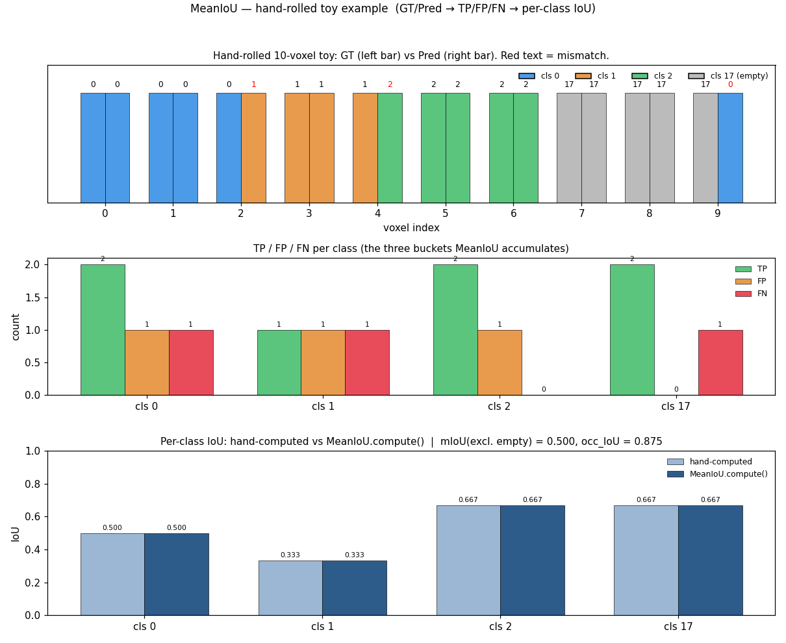
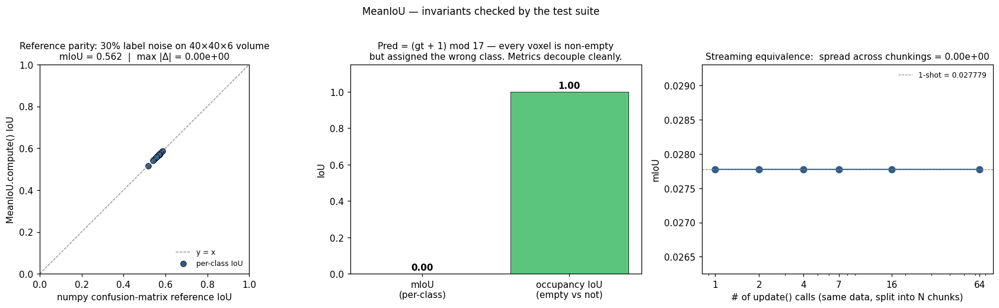

# MeanIoU correctness benchmark

Validates the Stage-2 evaluation metric in [../s2go/stage2/miou.py](../s2go/stage2/miou.py) — the same `MeanIoU` instance that [../s2go/tools/stage2_eval.py](../s2go/tools/stage2_eval.py) calls to produce the headline `mIoU` and `occupancy_IoU` numbers.

## How to run

```bash
source /home/skr/miniconda3/etc/profile.d/conda.sh
conda activate /media/skr/storage/conda_envs/selfocc
python tests/test_miou.py            # tests + write PNGs into tests/
python tests/test_miou.py --no-viz   # tests only
```

Exits non-zero on any failure. No pytest dependency.

## What gets checked

| # | Case | Invariant |
|---|------|-----------|
| 1 | perfect prediction | `pred == gt` everywhere → `mIoU == 1.0`, `occ_IoU == 1.0` |
| 2 | all-empty prediction | GT has no empty voxels, pred is all-empty → `occ_IoU == 0`, every fg-class `IoU == 0` |
| 3 | hand-rolled tiny example | 10 voxels with known TP/FP/FN per class → per-class IoUs and `mIoU` match the closed-form `TP / (TP + FP + FN)` |
| 4 | vs numpy confusion-matrix | 30%-noise random `(40, 40, 6)` volume → per-class IoU matches an independent `np.bincount` confusion-matrix reference to **1e-6** |
| 5 | streaming equivalence | One `update(pred, gt)` call ≡ K chunked calls on the same data, for `K ∈ {1, 2, 4, 7, 16, 64}` |
| 6 | mask drops voxels | `mask` parameter excludes voxels from *all* counts (seen, correct, positive), not just from the mean |
| 7 | `ignore_classes` semantics | Including vs excluding empty changes mIoU from `0.5417` → `0.5` on the hand-rolled example |
| 8 | absent class dropped | A class with `seen == 0` is **dropped** from the mean rather than counted as NaN/0 — small eval slices won't poison `mIoU` |
| 9 | occupancy decoupled | Pred = `(gt + 1) mod 17` (always non-empty, always wrong class) → `occ_IoU = 1.0` with `mIoU = 0.0` |

Result on this machine (CUDA, RTX 3060):

```
9/9 cases passed
```

## Figures

### Hand-rolled toy example — [miou_case_hand_rolled.png](miou_case_hand_rolled.png)



Three stacked panels walking the metric end-to-end on a 10-voxel sequence:

- **Top:** GT (left bar) vs Pred (right bar) per voxel. Red text marks mismatches. Voxels 2, 4, 9 are predicted wrong.
- **Middle:** the three buckets `MeanIoU` actually accumulates — `total_seen` (FN+TP), `total_correct` (TP), `total_positive` (TP+FP) — visualized here as TP / FP / FN per class.
- **Bottom:** hand-computed IoU vs `MeanIoU.compute()` output. They agree to 1e-6 for cls 0 (0.500), cls 1 (0.333), cls 2 (0.667), cls 17/empty (0.667). The reported `mIoU = 0.500` is the mean of the three fg classes; `occupancy_IoU = 0.875` because 7/8 voxels-marked-occupied agree.

This is the load-bearing test: if anyone tweaks the IoU formula in [../s2go/stage2/miou.py:88](../s2go/stage2/miou.py#L88) and breaks the contract, this figure points straight at which class's accounting drifted.

### Three structural invariants — [miou_invariants.png](miou_invariants.png)



- **Left — Reference parity.** On a random `(40, 40, 6)` volume with 30% label noise, per-class IoU from `MeanIoU` is plotted against the IoU computed by an independent `np.bincount`-based confusion matrix ([test_miou.py:42-58](test_miou.py#L42-L58)). All points land on `y = x` with `max |Δ| = 0`. This rules out porting drift from the upstream `reference_code/GaussianFormer/misc/metric_util.py:MeanIoU` implementation.
- **Middle — Occupancy decoupled.** Construct predictions that are *always non-empty* but *always assigned the wrong class*. The two metrics fall on opposite extremes (`mIoU = 0.00`, `occ_IoU = 1.00`), confirming the per-class and binary occupancy buckets are independent.
- **Right — Streaming equivalence.** Split 10,000 voxels into K chunks for `K ∈ {1, 2, 4, 7, 16, 64}` and call `update()` once per chunk. mIoU is bit-identical (spread = 0). Means the per-batch update pattern in [../s2go/tools/stage2_eval.py:171](../s2go/tools/stage2_eval.py#L171) is safe to extend to multi-batch evaluation.

## What this does *not* check

- The end-to-end Stage-2 eval pipeline (G2V rasterization → argmax → mask-by-occ-threshold → `update`). Run [../s2go/tools/stage2_eval.py](../s2go/tools/stage2_eval.py) on an actual checkpoint for that.
- DDP/all-reduce semantics — the port deliberately strips distributed sync ([../s2go/stage2/miou.py:4](../s2go/stage2/miou.py#L4)); single-GPU eval only.
- Numerical precision on very large counts (>2³² voxels). The buckets are stored as `float32` tensors; this is fine for nuScenes voxel counts but would need promotion for substantially larger volumes.
